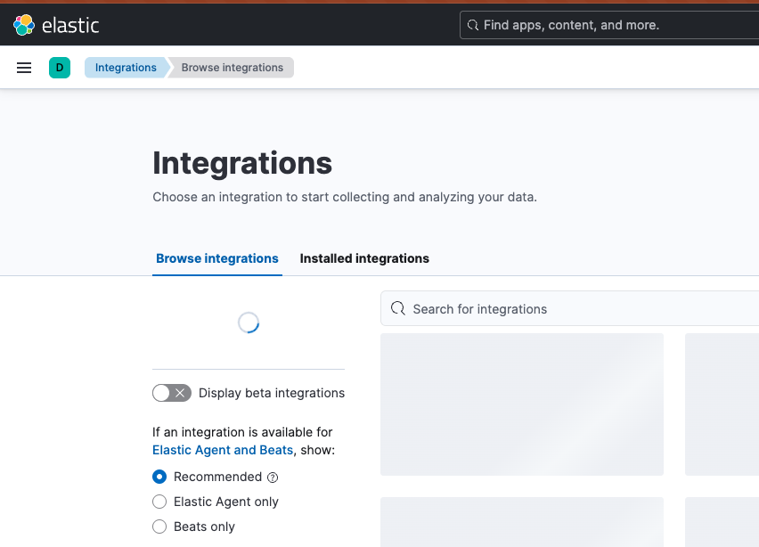
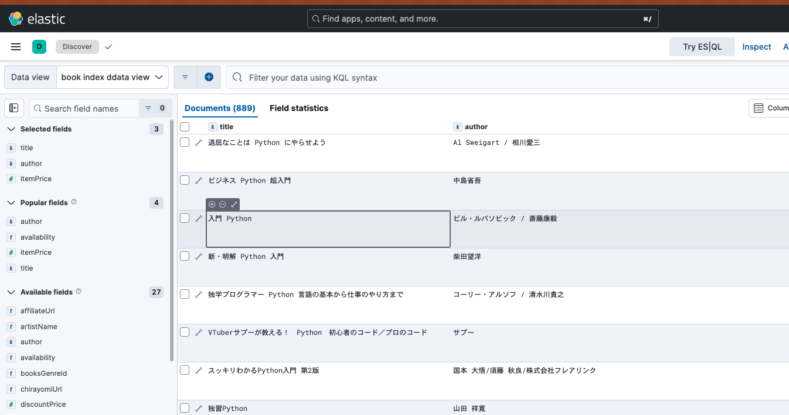
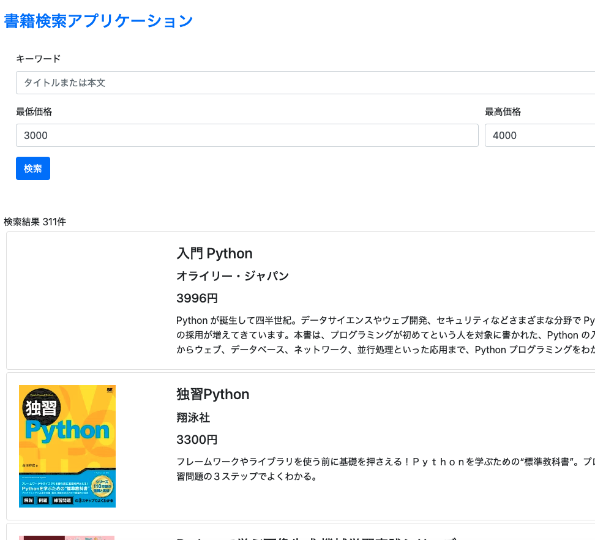

# elasticsearch python tutorial

**Date:** 2025-04-02 23:24:54

[Pythonで作るはじめてのElasticsearchアプリケーション: Pythonで作る検索アプリケーション入門](https://www.amazon.co.jp/Python%E3%81%A7%E4%BD%9C%E3%82%8B%E3%81%AF%E3%81%98%E3%82%81%E3%81%A6%E3%81%AEElasticsearch%E3%82%A2%E3%83%97%E3%83%AA%E3%82%B1%E3%83%BC%E3%82%B7%E3%83%A7%E3%83%B3-%E6%9C%AC%E7%94%B0%E5%B4%87%E6%99%BA-ebook/dp/B082ZTXBNZ)を読んだのでその感想ややったことを書く。

## 1章
Elasticsearchは、Elastic社が提供するオープンソースの全文検索サービス
全文検索とは、コンピュータにおいて、複数の文書（ファイル）から特定の文字列を検索すること。（出典:https://ja.wikipedia.org/wiki/%E5%85%A8%E6%96%87%E6%A4%9C%E7%B4%A2）

Pythonで作成した検索アプリケーションを通して学ぶ。

Elasticsearchは高速で、かつNodeと呼ばれるサーバを増やすことでデータ量や書き込み速度を分散させることができ、スケールさせることもできる。

Elasticsearch,Kibana,Beats,Logstashの4つのコアソリューションをElastic Stackとよぶ。

### ElasticSearchのインストール
本ではインストールしていたが、ここではDockerを使ってみる。
https://hub.docker.com/_/Elasticsearch

docker-hubからpullしてくる。
```sh
docker pull elasticsearch
```

最新のelasticsearchをpull使用すると存在しないとエラーになった。
```sh
Error response from daemon: manifest for elasticsearch:latest not found: manifest unknown: manifest unknown
```

tagから最新のバージョンを調べて取得してきた。（8.17.4が最新だった）
```sh
docker pull elasticsearch:8.17.4
```

Dockerfileとdocker-compose.ymlを作成してelasticsearchのコンテナを作ることにした。

-- Dockerfile
```dockerfile
FROM elasticsearch:8.17.4

RUN elasticsearch-plugin install --batch analysis-kuromoji
```

-- docker-compose.yml
```yml
version: "3.8"

services:
  elasticsearch:
    build: .
    container_name: es-kuromoji
    ports:
      - 9200:9200
      - 9300:9300
    environment:
      - discovery.type=single-node
      - xpack.security.enabled=false
      - xpack.security.transport.ssl.enabled=false
    volumes:
      - type: volume
        source: es_data
        target: /usr/share/elasticsearch/data

volumes:
  es_data:
```

ビルドする
```sh
docker-compose up -d --build
```

curlコマンド
```sh
♥ ❯ curl http://localhost:9200
{
  "name" : "1a34d95fa296",
  "cluster_name" : "docker-cluster",
  "cluster_uuid" : "IyRosjCZTzGk7_03S1D-4w",
  "version" : {
    "number" : "8.17.4",
    "build_flavor" : "default",
    "build_type" : "docker",
    "build_hash" : "c63c7f5f8ce7d2e4805b7b3d842e7e792d84dda1",
    "build_date" : "2025-03-20T15:39:59.811110136Z",
    "build_snapshot" : false,
    "lucene_version" : "9.12.0",
    "minimum_wire_compatibility_version" : "7.17.0",
    "minimum_index_compatibility_version" : "7.0.0"
  },
  "tagline" : "You Know, for Search"
}
```

### kibanaのインストール
Kibanaをインストールできるようのdocker-compose.ymlに追記した。

```yml
version: "3.8"

services:
  elasticsearch:
    build: .
    container_name: es-kuromoji
    ports:
      - 9200:9200
      - 9300:9300
    environment:
      - discovery.type=single-node
      - xpack.security.enabled=false
      - xpack.security.transport.ssl.enabled=false
    volumes:
      - type: volume
        source: es_data
        target: /usr/share/elasticsearch/data

  kibana:
    image: docker.elastic.co/kibana/kibana:8.17.4
    container_name: kibana
    environment:
      - ELASTICSEARCH_HOSTS=http://elasticsearch:9200
    ports:
      - 5601:5601
    depends_on:
      - elasticsearch

volumes:
  es_data:
```

http:localhost:5601にアクセスすると以下のように画面が開く。



### Elasticsearch security
バージョン6.8以降では、Elasticsearch Securityと呼ばれるセキュリティ機能がついた。
ElasticsearchおよびKibanaに接続する際はID/PWを求めるようになる。

以下を設定するとセキュリティ機能が有効になる。
今回はローカルでの検証が主になるので割愛する。
```sh
xpack.security.enabled: true
```

kibanaからelasticsearchに接続する場合は。認証情報の設定が必要。
`config/kibana.yml`に記載する。
```sh
elasticsearch.username: "kibana"
elasticsearch.password: "xxxxxxxxxx"
```

### Elasticsearchの概念 - インデックス・ドキュメント・マッピング
Elasticsearchは分散ドキュメントストアと呼ばれる。
保存されるデータの最小単位がドキュメント。
フィールドと呼ばれる複数の属性を持っている。
インデックスは、ドキュメントの集合。

### ドキュメントの操作
以下のJSONを入力して実行する。
```json
PUT /book/_doc/1
{
    "title": "ビジネス Python 超入門",
    "author": "中島省吾",
    "publisher": "日経BP",
    "salesDate": "2019年06月07日",
    "itemPrice": 2592
}
```

以下のレスポンスが返ってきてドキュメントが作成される。
```json
{
  "_index": "book",
  "_id": "1",
  "_version": 1,
  "result": "created",
  "_shards": {
    "total": 2,
    "successful": 1,
    "failed": 0
  },
  "_seq_no": 0,
  "_primary_term": 1
}
```

POSTメソッドでIDを指定せずにドキュメントを作成すると自動的にドキュメントが割り当てられる。
```json
POST /book/_doc/
{
    "title": "真・明解Python 入門",
    "author": "柴田望洋",
    "publisher": "SBクリエイティブ",
    "salesDate": "2019年05月24日",
    "itemPrice": 2808
}
```
レスポンスは以下になる。
```json
{
  "_index": "book",
  "_id": "semABJYBVRBE8arB10LK",
  "_version": 1,
  "result": "created",
  "_shards": {
    "total": 2,
    "successful": 1,
    "failed": 0
  },
  "_seq_no": 3,
  "_primary_term": 1
}
```

GETメソッドでドキュメントを取得する。

```json
GET /book/_doc/1
```

ドキュメントIDが1のドキュメントが返ってくる。
ドキュメントの内容は、`_source`の中に含まれる。
リクエストしたドキュメントが見つかった場合は`found`が`true`になる。
```json
{
  "_index": "book",
  "_id": "1",
  "_version": 3,
  "_seq_no": 2,
  "_primary_term": 1,
  "found": true,
  "_source": {
    "title": "ビジネス Python 超入門",
    "author": "中島省吾",
    "publisher": "日経BP",
    "salesDate": "2019年06月07日",
    "itemPrice": 2592
  }
}
```

ドキュメントを更新したい場合、`[インデックス名/_update/[ドキュメントID]]`にたしてPOSTメソッドでリクエストする。
```json
POST /book/_update/1
{
    "doc": {
        "itemPrice": 1292
    }
}
```
レスポンスは以下になる。
更新された時はresultの値がupdatedになる。
```json
{
  "_index": "book",
  "_id": "1",
  "_version": 4,
  "result": "updated",
  "_shards": {
    "total": 2,
    "successful": 1,
    "failed": 0
  },
  "_seq_no": 4,
  "_primary_term": 1
}
```

ドキュメントを取得する。
```json
GET /book/_doc/1
```
レスポンスは以下のようなり、更新されている。
```json
{
  "_index": "book",
  "_id": "1",
  "_version": 4,
  "_seq_no": 4,
  "_primary_term": 1,
  "found": true,
  "_source": {
    "title": "ビジネス Python 超入門",
    "author": "中島省吾",
    "publisher": "日経BP",
    "salesDate": "2019年06月07日",
    "itemPrice": 1292
  }
}
```

ドキュメントを削除するには`[インデックス名]/_doc/[ドキュメントID]`にDELETEメソッドでリクエストする。
```json
DELETE /book/_doc/1
```
レスポンスは以下のようになる。
resultがdeletedになり、ドキュメントが削除されていることを確認できる。
```json
{
  "_index": "book",
  "_id": "1",
  "_version": 5,
  "result": "deleted",
  "_shards": {
    "total": 2,
    "successful": 1,
    "failed": 0
  },
  "_seq_no": 5,
  "_primary_term": 1
}
```

ドキュメントを取得する。
```json
GET /book/_doc/1
```
レスポンスのfoundがfalseになってるので、ドキュメントが削除されたことが確認できる。
```json
{
  "_index": "book",
  "_id": "1",
  "found": false
}
```

### インデックスの操作
`[インデックス名]`に対して、GETメソッドでリクエストする。
```json
GET /book
```

レスポンスは以下のようになる。
大きく分けて、インデックスに関する`mappings`と`settings`の情報を取得する。
`mappings`はDBにおけるテーブル定義のようなもの。
`settings`はインデックスの作成日時、シャードの数、レブリカ数などを確認できる。
```json
{
  "book": {
    "aliases": {},
    "mappings": {
      "properties": {
        "author": {
          "type": "text",
          "fields": {
            "keyword": {
              "type": "keyword",
              "ignore_above": 256
            }
          }
        },
        "itemPrice": {
          "type": "long"
        },
        "publisher": {
          "type": "text",
          "fields": {
            "keyword": {
              "type": "keyword",
              "ignore_above": 256
            }
          }
        },
        "salesDate": {
          "type": "text",
          "fields": {
            "keyword": {
              "type": "keyword",
              "ignore_above": 256
            }
          }
        },
        "title": {
          "type": "text",
          "fields": {
            "keyword": {
              "type": "keyword",
              "ignore_above": 256
            }
          }
        }
      }
    },
    "settings": {
      "index": {
        "routing": {
          "allocation": {
            "include": {
              "_tier_preference": "data_content"
            }
          }
        },
        "number_of_shards": "1",
        "provided_name": "book",
        "creation_date": "1743831277838",
        "number_of_replicas": "1",
        "uuid": "0D4ca4tVTZy5s7j6sgwE3w",
        "version": {
          "created": "8521000"
        }
      }
    }
  }
}
```

DELETEメソッドでインデックスの削除をする。
```json
DELETE /book
```

acknowledgedがtrueになればインデックスが削除されている。
```json
{
  "acknowledged": true
}
```

GETメソッドで取得するとエラーレスポンスが返ってくる。
`no such index [book]`とエラーが返ってきて、インデックスがすでに削除みであることが確認できる。
```json
{
  "error": {
    "root_cause": [
      {
        "type": "index_not_found_exception",
        "reason": "no such index [book]",
        "resource.type": "index_or_alias",
        "resource.id": "book",
        "index_uuid": "_na_",
        "index": "book"
      }
    ],
    "type": "index_not_found_exception",
    "reason": "no such index [book]",
    "resource.type": "index_or_alias",
    "resource.id": "book",
    "index_uuid": "_na_",
    "index": "book"
  },
  "status": 404
}
```

インデックスの作成にはPUTメソッドでリクエストする。
```json
PUT /book
```

レスポンスのindexにbookと表示され、インデックスが作成される。
```json
{
  "acknowledged": true,
  "shards_acknowledged": true,
  "index": "book"
}
```

### マッピングの操作
マッピングはDBにおけるテーブル定義に相当する。

`[インデックス名]/_mapping`に対して、GETメソッドをリクエストする。
```json
GET /book/_mapping
```

レスポンスは以下になる。
```json
{
  "book": {
    "mappings": {}
  }
}
```

クエリを追加して確認する。

```json
{
  "book": {
    "mappings": {
      "properties": {
        "author": {
          "type": "text",
          "fields": {
            "keyword": {
              "type": "keyword",
              "ignore_above": 256
            }
          }
        },
        "itemPrice": {
          "type": "long"
        },
        "publisher": {
          "type": "text",
          "fields": {
            "keyword": {
              "type": "keyword",
              "ignore_above": 256
            }
          }
        },
        "salesDate": {
          "type": "text",
          "fields": {
            "keyword": {
              "type": "keyword",
              "ignore_above": 256
            }
          }
        },
        "title": {
          "type": "text",
          "fields": {
            "keyword": {
              "type": "keyword",
              "ignore_above": 256
            }
          }
        }
      }
    }
  }
}
```

properties内に、実際の各フィールドに対するタイプ情報が格納される。

インデックス削除後、マッピングを指定してインデックスを作成する。
```json
PUT /book
{
  "mappings": {
    "properties": {
      "title": {"type": "keyword"},
      "author": {"type": "keyword"},
      "publisherName": {"type": "keyword"},
      "isbn": {"type": "keyword"},
      "itemCaption": {"type": "text"},
      "itemPrice": {"type": "long"}
    }
  }
}
```

レスポンスは以下になる。
```json
{
  "acknowledged": true,
  "shards_acknowledged": true,
  "index": "book"
}
```

GETメソッドでマッピングを確認する
```json
GET /book/_mapping
```

```json
{
  "book": {
    "mappings": {
      "properties": {
        "author": {
          "type": "keyword"
        },
        "isbn": {
          "type": "keyword"
        },
        "itemCaption": {
          "type": "text"
        },
        "itemPrice": {
          "type": "long"
        },
        "publisherName": {
          "type": "keyword"
        },
        "title": {
          "type": "keyword"
        }
      }
    }
  }
}
```

### その他主要な操作
複数のドキュメントを一気に作成するには、`/[インデックス名]/_bulk`に対して、POSTメソッドでリクエストする。
```json
POST /book/_bulk
{"index": {"_id": 1}}
{ "title": "退屈なことは Python にやらせよう", "author": "Al Sweigart / 相川愛三", "publisherName": "オライリー・ジャパン", "isbn": "9784873117782", "itemCaption": "ファイル名の変更や表計算のデータ更新といった作業は、日々の仕事の中で頻繁に発生します。ひとつふたつ修正するだけであれば問題ないのですが、それが数十、数百となってくると手に負えません。そのような単純な繰り返し作業はコンピュータに肩代わりしてもらうとすごくラクになります。本書では、手作業だと膨大に時間がかかる処理を一瞬でこなす Python 3 プログラムの作り方について学びます。対象読者はノンプログラマー。本書で基本をマスターすれば、プログラミング未経験者でも面倒な単純作業を苦もなくこなす便利なプログラムを作れるようになります。さらに、章末の練習問題を解くことで、類似のタスクを自動処理するスキルをもっと高めることができます。" }
{"index": {"_id": 2}}
{ "title": "ビジネス Python 超入門", "author": "中島省吾", "publisherName": "日経BP", "isbn": "9784296102136", "itemCaption": "ビジネスに欠かせないプログラミングの基本スキルが学べる！人工知能で注目の言語、Python を初歩から解説。書き方から実行手順までステップ・バイ・ステップ。条件分岐や繰り返しなどの必須構文を着実にマスター。ネットの情報を自動取得、Web スクレイピングの基礎。手書き文字を認識する機械学習をゼロから体験。", "itemPrice": 2592 }
{"index": {"_id": 3}}
{ "title": "入門 Python", "author": "ビル・ルバソビック / 斎藤康毅", "publisherName": "オライリー・ジャパン", "isbn": "9784873117386", "itemCaption": "Python が誕生して四半世紀。データサイエンスやウェブ開発、セキュリティなどさまざまな分野で Python の人気が急上昇中です。プログラミング教育の現場でも C に代わって Python の採用が増えてきています。本書は、プログラミングが初めてという人を対象に書かれた、Python の入門書です。前提とする知識は特にありません。プログラミングおよび Python の基礎からウェブ、データベース、ネットワーク、並行処理といった応用まで、Python プログラミングをわかりやすく丁寧に説明します。", "itemPrice": 3996 }
{"index": {"_id": 4}}
{ "title": "新・明解 Python 入門", "author": "柴田望洋", "publisherName": "SB クリエイティブ", "isbn": "9784815601522", "itemCaption": "適切なサンプルプログラム 299 編と分かりやすい図表 165 点で、Python の文法とプログラミングの基礎を系統立てて着実に学習できます。", "itemPrice": 2808 }
{"index": {"_id": 5}}
{ "title": "独学プログラマー Python 言語の基本から仕事のやり方まで", "author": "コーリー・アルソフ / 清水川貴之", "publisherName": "日経BP", "isbn": "9784822292270", "itemCaption": "オブジェクト指向、シェル、正規表現、パッケージ管理、バージョン管理、データ構造、アルゴリズム、仕事の見つけ方・やり方。Python 言語の基本から仕事のやり方まで、プログラマーとして働くために必要な知識・ノウハウが 1 冊で丸わかり。", "itemPrice": 2376 }
```

レスポンスは下記になる。
```json
{
  "errors": false,
  "took": 0,
  "items": [
    {
      "index": {
        "_index": "book",
        "_id": "1",
        "_version": 1,
        "result": "created",
        "_shards": {
          "total": 2,
          "successful": 1,
          "failed": 0
        },
        "_seq_no": 0,
        "_primary_term": 1,
        "status": 201
      }
    },
    {
      "index": {
        "_index": "book",
        "_id": "2",
        "_version": 1,
        "result": "created",
        "_shards": {
          "total": 2,
          "successful": 1,
          "failed": 0
        },
        "_seq_no": 1,
        "_primary_term": 1,
        "status": 201
      }
    },
    {
      "index": {
        "_index": "book",
        "_id": "3",
        "_version": 1,
        "result": "created",
        "_shards": {
          "total": 2,
          "successful": 1,
          "failed": 0
        },
        "_seq_no": 2,
        "_primary_term": 1,
        "status": 201
      }
    },
    {
      "index": {
        "_index": "book",
        "_id": "4",
        "_version": 1,
        "result": "created",
        "_shards": {
          "total": 2,
          "successful": 1,
          "failed": 0
        },
        "_seq_no": 3,
        "_primary_term": 1,
        "status": 201
      }
    },
    {
      "index": {
        "_index": "book",
        "_id": "5",
        "_version": 1,
        "result": "created",
        "_shards": {
          "total": 2,
          "successful": 1,
          "failed": 0
        },
        "_seq_no": 4,
        "_primary_term": 1,
        "status": 201
      }
    }
  ]
}
```

ドキュメントへの項目追加は、ドキュメントの更新と同じように`/[インデックス名]/_update/[ドキュメントID]`に対してPOSTメソッドでリクエストする。
discountRateというフィールドと0という値を追加する。
```json
POST /book/_update/5
{
  "doc": {
    "discountRate": 0
  }
}
```

レスポンスは以下のようにある。
```json
{
  "_index": "book",
  "_id": "5",
  "_version": 2,
  "result": "updated",
  "_shards": {
    "total": 2,
    "successful": 1,
    "failed": 0
  },
  "_seq_no": 5,
  "_primary_term": 1
}
```

ドキュメント内容を取得して確認するとフィールドと値が追加されている。
```json
{
  "_index": "book",
  "_id": "5",
  "_version": 2,
  "_seq_no": 5,
  "_primary_term": 1,
  "found": true,
  "_source": {
    "title": "独学プログラマー Python 言語の基本から仕事のやり方まで",
    "author": "コーリー・アルソフ / 清水川貴之",
    "publisherName": "日経BP",
    "isbn": "9784822292270",
    "itemCaption": "オブジェクト指向、シェル、正規表現、パッケージ管理、バージョン管理、データ構造、アルゴリズム、仕事の見つけ方・やり方。Python 言語の基本から仕事のやり方まで、プログラマーとして働くために必要な知識・ノウハウが 1 冊で丸わかり。",
    "itemPrice": 2376,
    "discountRate": 0
  }
}
```

### Elasticsearchにようる様々な検索方法を学ぶ
全てのドキュメントを検索する場合は`[インデックス名]/_search`に対してGETメソッドをリクエストする。
```json
GET /book/_search
```

レスポンスは以下のようになる。
hitsの中に検索結果が格納されている。
totalのなかのvalueがヒットした件数になる。
さらに同じhitsという項目があり、この中に具体的にヒットしたドキュメントの内容が返却される。
デフォルトでは最大10件しか返さない。
`/[インデックス名]/_search?size=20`のようにsizeパラメータで検索件数を指定する。
```json
{
  "took": 112,
  "timed_out": false,
  "_shards": {
    "total": 1,
    "successful": 1,
    "skipped": 0,
    "failed": 0
  },
  "hits": {
    "total": {
      "value": 5,
      "relation": "eq"
    },
    "max_score": 1,
    "hits": [
      {
        "_index": "book",
        "_id": "1",
        "_score": 1,
        "_source": {
          "title": "退屈なことは Python にやらせよう",
          "author": "Al Sweigart / 相川愛三",
          "publisherName": "オライリー・ジャパン",
          "isbn": "9784873117782",
          "itemCaption": "ファイル名の変更や表計算のデータ更新といった作業は、日々の仕事の中で頻繁に発生します。ひとつふたつ修正するだけであれば問題ないのですが、それが数十、数百となってくると手に負えません。そのような単純な繰り返し作業はコンピュータに肩代わりしてもらうとすごくラクになります。本書では、手作業だと膨大に時間がかかる処理を一瞬でこなす Python 3 プログラムの作り方について学びます。対象読者はノンプログラマー。本書で基本をマスターすれば、プログラミング未経験者でも面倒な単純作業を苦もなくこなす便利なプログラムを作れるようになります。さらに、章末の練習問題を解くことで、類似のタスクを自動処理するスキルをもっと高めることができます。"
        }
      },
      {
        "_index": "book",
        "_id": "2",
        "_score": 1,
        "_source": {
          "title": "ビジネス Python 超入門",
          "author": "中島省吾",
          "publisherName": "日経BP",
          "isbn": "9784296102136",
          "itemCaption": "ビジネスに欠かせないプログラミングの基本スキルが学べる！人工知能で注目の言語、Python を初歩から解説。書き方から実行手順までステップ・バイ・ステップ。条件分岐や繰り返しなどの必須構文を着実にマスター。ネットの情報を自動取得、Web スクレイピングの基礎。手書き文字を認識する機械学習をゼロから体験。",
          "itemPrice": 2592
        }
      },
      {
        "_index": "book",
        "_id": "3",
        "_score": 1,
        "_source": {
          "title": "入門 Python",
          "author": "ビル・ルバソビック / 斎藤康毅",
          "publisherName": "オライリー・ジャパン",
          "isbn": "9784873117386",
          "itemCaption": "Python が誕生して四半世紀。データサイエンスやウェブ開発、セキュリティなどさまざまな分野で Python の人気が急上昇中です。プログラミング教育の現場でも C に代わって Python の採用が増えてきています。本書は、プログラミングが初めてという人を対象に書かれた、Python の入門書です。前提とする知識は特にありません。プログラミングおよび Python の基礎からウェブ、データベース、ネットワーク、並行処理といった応用まで、Python プログラミングをわかりやすく丁寧に説明します。",
          "itemPrice": 3996
        }
      },
      {
        "_index": "book",
        "_id": "4",
        "_score": 1,
        "_source": {
          "title": "新・明解 Python 入門",
          "author": "柴田望洋",
          "publisherName": "SB クリエイティブ",
          "isbn": "9784815601522",
          "itemCaption": "適切なサンプルプログラム 299 編と分かりやすい図表 165 点で、Python の文法とプログラミングの基礎を系統立てて着実に学習できます。",
          "itemPrice": 2808
        }
      },
      {
        "_index": "book",
        "_id": "5",
        "_score": 1,
        "_source": {
          "title": "独学プログラマー Python 言語の基本から仕事のやり方まで",
          "author": "コーリー・アルソフ / 清水川貴之",
          "publisherName": "日経BP",
          "isbn": "9784822292270",
          "itemCaption": "オブジェクト指向、シェル、正規表現、パッケージ管理、バージョン管理、データ構造、アルゴリズム、仕事の見つけ方・やり方。Python 言語の基本から仕事のやり方まで、プログラマーとして働くために必要な知識・ノウハウが 1 冊で丸わかり。",
          "itemPrice": 2376,
          "discountRate": 0
        }
      }
    ]
  }
}
```

ある単語を含むドキュメントを検索するには、リクエストbodyに以下のように記載する。
```json
{
  "query": {
    "match": {
      "[フィールド名]":"[値]"
    }
  }
}
```

itemCaptionにプログラミングを含むドキュメントを検索する。
```json
GET book/_search
{
  "query": {
    "match": {
      "itemCaption": "プログラミング"
    }
  }
}
```

レスポンスは以下のようになる。
itemCaptionを見ると、プログラミングの文字列が入っている。
```json
{
  "took": 115,
  "timed_out": false,
  "_shards": {
    "total": 1,
    "successful": 1,
    "skipped": 0,
    "failed": 0
  },
  "hits": {
    "total": {
      "value": 4,
      "relation": "eq"
    },
    "max_score": 0.7144865,
    "hits": [
      {
        "_index": "book",
        "_id": "3",
        "_score": 0.7144865,
        "_source": {
          "title": "入門 Python",
          "author": "ビル・ルバソビック / 斎藤康毅",
          "publisherName": "オライリー・ジャパン",
          "isbn": "9784873117386",
          "itemCaption": "Python が誕生して四半世紀。データサイエンスやウェブ開発、セキュリティなどさまざまな分野で Python の人気が急上昇中です。プログラミング教育の現場でも C に代わって Python の採用が増えてきています。本書は、プログラミングが初めてという人を対象に書かれた、Python の入門書です。前提とする知識は特にありません。プログラミングおよび Python の基礎からウェブ、データベース、ネットワーク、並行処理といった応用まで、Python プログラミングをわかりやすく丁寧に説明します。",
          "itemPrice": 3996
        }
      },
      {
        "_index": "book",
        "_id": "4",
        "_score": 0.5952287,
        "_source": {
          "title": "新・明解 Python 入門",
          "author": "柴田望洋",
          "publisherName": "SB クリエイティブ",
          "isbn": "9784815601522",
          "itemCaption": "適切なサンプルプログラム 299 編と分かりやすい図表 165 点で、Python の文法とプログラミングの基礎を系統立てて着実に学習できます。",
          "itemPrice": 2808
        }
      },
      {
        "_index": "book",
        "_id": "2",
        "_score": 0.47157782,
        "_source": {
          "title": "ビジネス Python 超入門",
          "author": "中島省吾",
          "publisherName": "日経BP",
          "isbn": "9784296102136",
          "itemCaption": "ビジネスに欠かせないプログラミングの基本スキルが学べる！人工知能で注目の言語、Python を初歩から解説。書き方から実行手順までステップ・バイ・ステップ。条件分岐や繰り返しなどの必須構文を着実にマスター。ネットの情報を自動取得、Web スクレイピングの基礎。手書き文字を認識する機械学習をゼロから体験。",
          "itemPrice": 2592
        }
      },
      {
        "_index": "book",
        "_id": "1",
        "_score": 0.29757422,
        "_source": {
          "title": "退屈なことは Python にやらせよう",
          "author": "Al Sweigart / 相川愛三",
          "publisherName": "オライリー・ジャパン",
          "isbn": "9784873117782",
          "itemCaption": "ファイル名の変更や表計算のデータ更新といった作業は、日々の仕事の中で頻繁に発生します。ひとつふたつ修正するだけであれば問題ないのですが、それが数十、数百となってくると手に負えません。そのような単純な繰り返し作業はコンピュータに肩代わりしてもらうとすごくラクになります。本書では、手作業だと膨大に時間がかかる処理を一瞬でこなす Python 3 プログラムの作り方について学びます。対象読者はノンプログラマー。本書で基本をマスターすれば、プログラミング未経験者でも面倒な単純作業を苦もなくこなす便利なプログラムを作れるようになります。さらに、章末の練習問題を解くことで、類似のタスクを自動処理するスキルをもっと高めることができます。"
        }
      }
    ]
  }
}
```

and条件でドキュメントを検索するには、リクエストbodyに以下のように記載する。
```json
{
  "query": {
    "bool": {
      "must": [
        {first condition},
        {second condition},
        ...
      }
    }
  }
}
```

itemCaptionに`プログラミング`かつ`入門`の両方を含むドキュメント検索する。
```json
GET book/_search
{
  "query": {
    "bool": {
      "must": [
        {
          "match": {
            "itemCaption": "プログラミング"
          }
        },
        {
          "match": {
            "itemCaption": "入門"
          }
        }
      ]
    }
  }
}
```

レスポンスは以下のようになる。
```json
{
  "took": 17,
  "timed_out": false,
  "_shards": {
    "total": 1,
    "successful": 1,
    "skipped": 0,
    "failed": 0
  },
  "hits": {
    "total": {
      "value": 1,
      "relation": "eq"
    },
    "max_score": 3.4902334,
    "hits": [
      {
        "_index": "book",
        "_id": "3",
        "_score": 3.4902334,
        "_source": {
          "title": "入門 Python",
          "author": "ビル・ルバソビック / 斎藤康毅",
          "publisherName": "オライリー・ジャパン",
          "isbn": "9784873117386",
          "itemCaption": "Python が誕生して四半世紀。データサイエンスやウェブ開発、セキュリティなどさまざまな分野で Python の人気が急上昇中です。プログラミング教育の現場でも C に代わって Python の採用が増えてきています。本書は、プログラミングが初めてという人を対象に書かれた、Python の入門書です。前提とする知識は特にありません。プログラミングおよび Python の基礎からウェブ、データベース、ネットワーク、並行処理といった応用まで、Python プログラミングをわかりやすく丁寧に説明します。",
          "itemPrice": 3996
        }
      }
    ]
  }
}
```

not検索でドキュメントを検索するには、リクエストbodyに以下のように記載する。
```json
{
  "query": {
    "bool": {
      "must_not": [
        {conditions},
      ] 
    }
  }
}
```

itemCaptionに`入門`を含まないドキュメントを検索する。
```json
GET /book/_search
{
  "query": {
    "bool": {
      "must_not": [
        {
          "match": {
            "itemCaption": "入門"
          }
        }
      ]
    }
  }
}
```

レスポンスは以下のようになる。
itemCaptionに`入門`が含まれていないことがわかる。
```json
{
  "took": 7,
  "timed_out": false,
  "_shards": {
    "total": 1,
    "successful": 1,
    "skipped": 0,
    "failed": 0
  },
  "hits": {
    "total": {
      "value": 4,
      "relation": "eq"
    },
    "max_score": 0,
    "hits": [
      {
        "_index": "book",
        "_id": "1",
        "_score": 0,
        "_source": {
          "title": "退屈なことは Python にやらせよう",
          "author": "Al Sweigart / 相川愛三",
          "publisherName": "オライリー・ジャパン",
          "isbn": "9784873117782",
          "itemCaption": "ファイル名の変更や表計算のデータ更新といった作業は、日々の仕事の中で頻繁に発生します。ひとつふたつ修正するだけであれば問題ないのですが、それが数十、数百となってくると手に負えません。そのような単純な繰り返し作業はコンピュータに肩代わりしてもらうとすごくラクになります。本書では、手作業だと膨大に時間がかかる処理を一瞬でこなす Python 3 プログラムの作り方について学びます。対象読者はノンプログラマー。本書で基本をマスターすれば、プログラミング未経験者でも面倒な単純作業を苦もなくこなす便利なプログラムを作れるようになります。さらに、章末の練習問題を解くことで、類似のタスクを自動処理するスキルをもっと高めることができます。"
        }
      },
      {
        "_index": "book",
        "_id": "2",
        "_score": 0,
        "_source": {
          "title": "ビジネス Python 超入門",
          "author": "中島省吾",
          "publisherName": "日経BP",
          "isbn": "9784296102136",
          "itemCaption": "ビジネスに欠かせないプログラミングの基本スキルが学べる！人工知能で注目の言語、Python を初歩から解説。書き方から実行手順までステップ・バイ・ステップ。条件分岐や繰り返しなどの必須構文を着実にマスター。ネットの情報を自動取得、Web スクレイピングの基礎。手書き文字を認識する機械学習をゼロから体験。",
          "itemPrice": 2592
        }
      },
      {
        "_index": "book",
        "_id": "4",
        "_score": 0,
        "_source": {
          "title": "新・明解 Python 入門",
          "author": "柴田望洋",
          "publisherName": "SB クリエイティブ",
          "isbn": "9784815601522",
          "itemCaption": "適切なサンプルプログラム 299 編と分かりやすい図表 165 点で、Python の文法とプログラミングの基礎を系統立てて着実に学習できます。",
          "itemPrice": 2808
        }
      },
      {
        "_index": "book",
        "_id": "5",
        "_score": 0,
        "_source": {
          "title": "独学プログラマー Python 言語の基本から仕事のやり方まで",
          "author": "コーリー・アルソフ / 清水川貴之",
          "publisherName": "日経BP",
          "isbn": "9784822292270",
          "itemCaption": "オブジェクト指向、シェル、正規表現、パッケージ管理、バージョン管理、データ構造、アルゴリズム、仕事の見つけ方・やり方。Python 言語の基本から仕事のやり方まで、プログラマーとして働くために必要な知識・ノウハウが 1 冊で丸わかり。",
          "itemPrice": 2376,
          "discountRate": 0
        }
      }
    ]
  }
}
```

or検索でドキュメントを検索するには、リクエストbodyに以下のように記載する。
```json
{
  "query": {
    "bool": {
      "should": [
        {first condition},
        {second condition},
        ...
      ] 
    }
  }
}
```

itemCaptionに`プログラミング`もしくは`入門`を含むドキュメント検索する。
```json
GET book/_search
{
  "query": {
    "bool": {
      "should": [
        {
          "match": {
            "itemCaption": "プログラミング"
          }
        },
        {
          "match": {
            "itemCaption": "入門"
          }
        }
      ]
    }
  }
}
```

レスポンスは以下になる。
itemCaptionに`プログラミング`もしくは`入門`のいずれかが含まれる。
```json
{
  "took": 30,
  "timed_out": false,
  "_shards": {
    "total": 1,
    "successful": 1,
    "skipped": 0,
    "failed": 0
  },
  "hits": {
    "total": {
      "value": 4,
      "relation": "eq"
    },
    "max_score": 3.4902334,
    "hits": [
      {
        "_index": "book",
        "_id": "3",
        "_score": 3.4902334,
        "_source": {
          "title": "入門 Python",
          "author": "ビル・ルバソビック / 斎藤康毅",
          "publisherName": "オライリー・ジャパン",
          "isbn": "9784873117386",
          "itemCaption": "Python が誕生して四半世紀。データサイエンスやウェブ開発、セキュリティなどさまざまな分野で Python の人気が急上昇中です。プログラミング教育の現場でも C に代わって Python の採用が増えてきています。本書は、プログラミングが初めてという人を対象に書かれた、Python の入門書です。前提とする知識は特にありません。プログラミングおよび Python の基礎からウェブ、データベース、ネットワーク、並行処理といった応用まで、Python プログラミングをわかりやすく丁寧に説明します。",
          "itemPrice": 3996
        }
      },
      {
        "_index": "book",
        "_id": "4",
        "_score": 0.5952287,
        "_source": {
          "title": "新・明解 Python 入門",
          "author": "柴田望洋",
          "publisherName": "SB クリエイティブ",
          "isbn": "9784815601522",
          "itemCaption": "適切なサンプルプログラム 299 編と分かりやすい図表 165 点で、Python の文法とプログラミングの基礎を系統立てて着実に学習できます。",
          "itemPrice": 2808
        }
      },
      {
        "_index": "book",
        "_id": "2",
        "_score": 0.47157782,
        "_source": {
          "title": "ビジネス Python 超入門",
          "author": "中島省吾",
          "publisherName": "日経BP",
          "isbn": "9784296102136",
          "itemCaption": "ビジネスに欠かせないプログラミングの基本スキルが学べる！人工知能で注目の言語、Python を初歩から解説。書き方から実行手順までステップ・バイ・ステップ。条件分岐や繰り返しなどの必須構文を着実にマスター。ネットの情報を自動取得、Web スクレイピングの基礎。手書き文字を認識する機械学習をゼロから体験。",
          "itemPrice": 2592
        }
      },
      {
        "_index": "book",
        "_id": "1",
        "_score": 0.29757422,
        "_source": {
          "title": "退屈なことは Python にやらせよう",
          "author": "Al Sweigart / 相川愛三",
          "publisherName": "オライリー・ジャパン",
          "isbn": "9784873117782",
          "itemCaption": "ファイル名の変更や表計算のデータ更新といった作業は、日々の仕事の中で頻繁に発生します。ひとつふたつ修正するだけであれば問題ないのですが、それが数十、数百となってくると手に負えません。そのような単純な繰り返し作業はコンピュータに肩代わりしてもらうとすごくラクになります。本書では、手作業だと膨大に時間がかかる処理を一瞬でこなす Python 3 プログラムの作り方について学びます。対象読者はノンプログラマー。本書で基本をマスターすれば、プログラミング未経験者でも面倒な単純作業を苦もなくこなす便利なプログラムを作れるようになります。さらに、章末の練習問題を解くことで、類似のタスクを自動処理するスキルをもっと高めることができます。"
        }
      }
    ]
  }
}
```

これまでの検索結果は、scoreの値が大きい順に返されていた。
socreは検索条件に対する関連どの高さを表す。
scoreを使って特定の検索条件にマッチしたものを上位表示させたい時、boostを使うことでその検索条件の関連度を高めることができる。
重み付けを行いたい検索条件のmatch文を以下の形式で記載する。
```json
"match": {
  "[フィールド名]": {
    "query": "[検索ワード]",
    "boost": [boost値]
  }
}
```

`入門`が含まれていた場合のスコアを5倍に重み付けして検索する。
```json
GET /book/_search
{
  "query": {
    "bool": {
      "should": [
        {
          "match": {
            "itemCaption": {
              "query": "プログラミング"
            }
          }
        },
        {
          "match": {
            "itemCaption": {
              "query": "入門",
              "boost": 5
            }
          }
        }
      ]
    }
  }
}
```

レスポンスは以下のようになる。
```json
{
  "took": 24,
  "timed_out": false,
  "_shards": {
    "total": 1,
    "successful": 1,
    "skipped": 0,
    "failed": 0
  },
  "hits": {
    "total": {
      "value": 4,
      "relation": "eq"
    },
    "max_score": 14.593221,
    "hits": [
      {
        "_index": "book",
        "_id": "3",
        "_score": 14.593221,
        "_source": {
          "title": "入門 Python",
          "author": "ビル・ルバソビック / 斎藤康毅",
          "publisherName": "オライリー・ジャパン",
          "isbn": "9784873117386",
          "itemCaption": "Python が誕生して四半世紀。データサイエンスやウェブ開発、セキュリティなどさまざまな分野で Python の人気が急上昇中です。プログラミング教育の現場でも C に代わって Python の採用が増えてきています。本書は、プログラミングが初めてという人を対象に書かれた、Python の入門書です。前提とする知識は特にありません。プログラミングおよび Python の基礎からウェブ、データベース、ネットワーク、並行処理といった応用まで、Python プログラミングをわかりやすく丁寧に説明します。",
          "itemPrice": 3996
        }
      },
      {
        "_index": "book",
        "_id": "4",
        "_score": 0.5952287,
        "_source": {
          "title": "新・明解 Python 入門",
          "author": "柴田望洋",
          "publisherName": "SB クリエイティブ",
          "isbn": "9784815601522",
          "itemCaption": "適切なサンプルプログラム 299 編と分かりやすい図表 165 点で、Python の文法とプログラミングの基礎を系統立てて着実に学習できます。",
          "itemPrice": 2808
        }
      },
      {
        "_index": "book",
        "_id": "2",
        "_score": 0.47157782,
        "_source": {
          "title": "ビジネス Python 超入門",
          "author": "中島省吾",
          "publisherName": "日経BP",
          "isbn": "9784296102136",
          "itemCaption": "ビジネスに欠かせないプログラミングの基本スキルが学べる！人工知能で注目の言語、Python を初歩から解説。書き方から実行手順までステップ・バイ・ステップ。条件分岐や繰り返しなどの必須構文を着実にマスター。ネットの情報を自動取得、Web スクレイピングの基礎。手書き文字を認識する機械学習をゼロから体験。",
          "itemPrice": 2592
        }
      },
      {
        "_index": "book",
        "_id": "1",
        "_score": 0.29757422,
        "_source": {
          "title": "退屈なことは Python にやらせよう",
          "author": "Al Sweigart / 相川愛三",
          "publisherName": "オライリー・ジャパン",
          "isbn": "9784873117782",
          "itemCaption": "ファイル名の変更や表計算のデータ更新といった作業は、日々の仕事の中で頻繁に発生します。ひとつふたつ修正するだけであれば問題ないのですが、それが数十、数百となってくると手に負えません。そのような単純な繰り返し作業はコンピュータに肩代わりしてもらうとすごくラクになります。本書では、手作業だと膨大に時間がかかる処理を一瞬でこなす Python 3 プログラムの作り方について学びます。対象読者はノンプログラマー。本書で基本をマスターすれば、プログラミング未経験者でも面倒な単純作業を苦もなくこなす便利なプログラムを作れるようになります。さらに、章末の練習問題を解くことで、類似のタスクを自動処理するスキルをもっと高めることができます。"
        }
      }
    ]
  }
}
```

一致した単語をハイライト表示させることが可能。
query文の後にhighligh文を追加する。
```json
"highlight": {
  "fields": {
    "[フィールド名]".{}
  }
}
```

以下のようなクエリを書く。
```json
GET book/_search
{
  "query": {
    "match": {
      "itemCaption": "プログラミング"
    }
  },
  "highlight": {
    "fields": {
      "itemCaption": {}
    }
  }
}
```

レスポンスは下記のようになる。
highlightフィールドが追加されている。
```json
{
  "took": 322,
  "timed_out": false,
  "_shards": {
    "total": 1,
    "successful": 1,
    "skipped": 0,
    "failed": 0
  },
  "hits": {
    "total": {
      "value": 4,
      "relation": "eq"
    },
    "max_score": 0.7144865,
    "hits": [
      {
        "_index": "book",
        "_id": "3",
        "_score": 0.7144865,
        "_source": {
          "title": "入門 Python",
          "author": "ビル・ルバソビック / 斎藤康毅",
          "publisherName": "オライリー・ジャパン",
          "isbn": "9784873117386",
          "itemCaption": "Python が誕生して四半世紀。データサイエンスやウェブ開発、セキュリティなどさまざまな分野で Python の人気が急上昇中です。プログラミング教育の現場でも C に代わって Python の採用が増えてきています。本書は、プログラミングが初めてという人を対象に書かれた、Python の入門書です。前提とする知識は特にありません。プログラミングおよび Python の基礎からウェブ、データベース、ネットワーク、並行処理といった応用まで、Python プログラミングをわかりやすく丁寧に説明します。",
          "itemPrice": 3996
        },
        "highlight": {
          "itemCaption": [
            "<em>プログラミング</em>教育の現場でも C に代わって Python の採用が増えてきています。本書は、<em>プログラミング</em>が初めてという人を対象に書かれた、Python の入門書です。",
            "<em>プログラミング</em>および Python の基礎からウェブ、データベース、ネットワーク、並行処理といった応用まで、Python <em>プログラミング</em>をわかりやすく丁寧に説明します。"
          ]
        }
      },
      {
        "_index": "book",
        "_id": "4",
        "_score": 0.5952287,
        "_source": {
          "title": "新・明解 Python 入門",
          "author": "柴田望洋",
          "publisherName": "SB クリエイティブ",
          "isbn": "9784815601522",
          "itemCaption": "適切なサンプルプログラム 299 編と分かりやすい図表 165 点で、Python の文法とプログラミングの基礎を系統立てて着実に学習できます。",
          "itemPrice": 2808
        },
        "highlight": {
          "itemCaption": [
            "適切なサンプルプログラム 299 編と分かりやすい図表 165 点で、Python の文法と<em>プログラミング</em>の基礎を系統立てて着実に学習できます。"
          ]
        }
      },
      {
        "_index": "book",
        "_id": "2",
        "_score": 0.47157782,
        "_source": {
          "title": "ビジネス Python 超入門",
          "author": "中島省吾",
          "publisherName": "日経BP",
          "isbn": "9784296102136",
          "itemCaption": "ビジネスに欠かせないプログラミングの基本スキルが学べる！人工知能で注目の言語、Python を初歩から解説。書き方から実行手順までステップ・バイ・ステップ。条件分岐や繰り返しなどの必須構文を着実にマスター。ネットの情報を自動取得、Web スクレイピングの基礎。手書き文字を認識する機械学習をゼロから体験。",
          "itemPrice": 2592
        },
        "highlight": {
          "itemCaption": [
            "ビジネスに欠かせない<em>プログラミング</em>の基本スキルが学べる！人工知能で注目の言語、Python を初歩から解説。書き方から実行手順までステップ・バイ・ステップ。"
          ]
        }
      },
      {
        "_index": "book",
        "_id": "1",
        "_score": 0.29757422,
        "_source": {
          "title": "退屈なことは Python にやらせよう",
          "author": "Al Sweigart / 相川愛三",
          "publisherName": "オライリー・ジャパン",
          "isbn": "9784873117782",
          "itemCaption": "ファイル名の変更や表計算のデータ更新といった作業は、日々の仕事の中で頻繁に発生します。ひとつふたつ修正するだけであれば問題ないのですが、それが数十、数百となってくると手に負えません。そのような単純な繰り返し作業はコンピュータに肩代わりしてもらうとすごくラクになります。本書では、手作業だと膨大に時間がかかる処理を一瞬でこなす Python 3 プログラムの作り方について学びます。対象読者はノンプログラマー。本書で基本をマスターすれば、プログラミング未経験者でも面倒な単純作業を苦もなくこなす便利なプログラムを作れるようになります。さらに、章末の練習問題を解くことで、類似のタスクを自動処理するスキルをもっと高めることができます。"
        },
        "highlight": {
          "itemCaption": [
            "本書で基本をマスターすれば、<em>プログラミング</em>未経験者でも面倒な単純作業を苦もなくこなす便利なプログラムを作れるようになります。"
          ]
        }
      }
    ]
  }
}
```

範囲での絞り込み検索を行うには、rangeを使用する。
この例はある特定のフィールdの値がある値以下であるドキュメントを検索する。
```json
{
  "query": {
    "range": {
      "[フィールド名]": {
        "lte": [値]
      }
    }
  }
}
```

itemPriceが3000以下のドキュメントを検索する。
```json
GET book/_search
{
  "query": {
    "range": {
      "itemPrice": {
        "lte": 3000
      }
    }
  }
}
```

レスポンスは以下のようになり、itemPriceが3000以下のものが検索される。
```json
{
  "took": 18,
  "timed_out": false,
  "_shards": {
    "total": 1,
    "successful": 1,
    "skipped": 0,
    "failed": 0
  },
  "hits": {
    "total": {
      "value": 3,
      "relation": "eq"
    },
    "max_score": 1,
    "hits": [
      {
        "_index": "book",
        "_id": "2",
        "_score": 1,
        "_source": {
          "title": "ビジネス Python 超入門",
          "author": "中島省吾",
          "publisherName": "日経BP",
          "isbn": "9784296102136",
          "itemCaption": "ビジネスに欠かせないプログラミングの基本スキルが学べる！人工知能で注目の言語、Python を初歩から解説。書き方から実行手順までステップ・バイ・ステップ。条件分岐や繰り返しなどの必須構文を着実にマスター。ネットの情報を自動取得、Web スクレイピングの基礎。手書き文字を認識する機械学習をゼロから体験。",
          "itemPrice": 2592
        }
      },
      {
        "_index": "book",
        "_id": "4",
        "_score": 1,
        "_source": {
          "title": "新・明解 Python 入門",
          "author": "柴田望洋",
          "publisherName": "SB クリエイティブ",
          "isbn": "9784815601522",
          "itemCaption": "適切なサンプルプログラム 299 編と分かりやすい図表 165 点で、Python の文法とプログラミングの基礎を系統立てて着実に学習できます。",
          "itemPrice": 2808
        }
      },
      {
        "_index": "book",
        "_id": "5",
        "_score": 1,
        "_source": {
          "title": "独学プログラマー Python 言語の基本から仕事のやり方まで",
          "author": "コーリー・アルソフ / 清水川貴之",
          "publisherName": "日経BP",
          "isbn": "9784822292270",
          "itemCaption": "オブジェクト指向、シェル、正規表現、パッケージ管理、バージョン管理、データ構造、アルゴリズム、仕事の見つけ方・やり方。Python 言語の基本から仕事のやり方まで、プログラマーとして働くために必要な知識・ノウハウが 1 冊で丸わかり。",
          "itemPrice": 2376,
          "discountRate": 0
        }
      }
    ]
  }
}
```

検索結果をソートするには、query文の後にsort文を使用する。
昇順でソートしたい場合は`asc`、降順でソートしたい場合は`desc`を使う。
```json
"sort": [
  {"[フィールド名]":{"order": "[asc or desc]"}}
]
```

itemPriceが3000以下で検索したドキュメントを、itemPriceの昇順にソートする。
```json
GET book/_search
{
  "query": {
    "range": {
      "itemPrice": {
        "lte": 3000
      }
    }
  },
  "sort": [
    {
      "itemPrice" : {
        "order": "asc"
      }
    }
  ]
}
```

レスポンスは以下のようになる。
```json
{
  "took": 12,
  "timed_out": false,
  "_shards": {
    "total": 1,
    "successful": 1,
    "skipped": 0,
    "failed": 0
  },
  "hits": {
    "total": {
      "value": 3,
      "relation": "eq"
    },
    "max_score": null,
    "hits": [
      {
        "_index": "book",
        "_id": "5",
        "_score": null,
        "_source": {
          "title": "独学プログラマー Python 言語の基本から仕事のやり方まで",
          "author": "コーリー・アルソフ / 清水川貴之",
          "publisherName": "日経BP",
          "isbn": "9784822292270",
          "itemCaption": "オブジェクト指向、シェル、正規表現、パッケージ管理、バージョン管理、データ構造、アルゴリズム、仕事の見つけ方・やり方。Python 言語の基本から仕事のやり方まで、プログラマーとして働くために必要な知識・ノウハウが 1 冊で丸わかり。",
          "itemPrice": 2376,
          "discountRate": 0
        },
        "sort": [
          2376
        ]
      },
      {
        "_index": "book",
        "_id": "2",
        "_score": null,
        "_source": {
          "title": "ビジネス Python 超入門",
          "author": "中島省吾",
          "publisherName": "日経BP",
          "isbn": "9784296102136",
          "itemCaption": "ビジネスに欠かせないプログラミングの基本スキルが学べる！人工知能で注目の言語、Python を初歩から解説。書き方から実行手順までステップ・バイ・ステップ。条件分岐や繰り返しなどの必須構文を着実にマスター。ネットの情報を自動取得、Web スクレイピングの基礎。手書き文字を認識する機械学習をゼロから体験。",
          "itemPrice": 2592
        },
        "sort": [
          2592
        ]
      },
      {
        "_index": "book",
        "_id": "4",
        "_score": null,
        "_source": {
          "title": "新・明解 Python 入門",
          "author": "柴田望洋",
          "publisherName": "SB クリエイティブ",
          "isbn": "9784815601522",
          "itemCaption": "適切なサンプルプログラム 299 編と分かりやすい図表 165 点で、Python の文法とプログラミングの基礎を系統立てて着実に学習できます。",
          "itemPrice": 2808
        },
        "sort": [
          2808
        ]
      }
    ]
  }
}
```

### アグリゲーション機能を利用した統計データの作成方法を学ぶ
Elasticsearchでは、1度のクエリで検索結果に加えて統計情報も同時に返す。

aggrigation文を利用して統計データを作成する。
query文の後に、以下の形式で記載する。
```json
"aggregations": {
  "<aggregation_name>": {
    "<aggregatio_type>": {
      <aggregation_body>
    }
  }
}
```

query文をしてしなければ全データが返されるので、全データに対してアグリゲーションを適用したい場合はquery文案誌で検索する。

aggrigation_nameは`itemPrice_bucket`とする。
範囲ごとの集計をおこうなうためにはaggrigation_typeにrangeを指定する。

```json
GET book/_search
{
  "aggregations": {
    "itemPrice_bucket": {
        "range": {
            "field": "itemPrice",
            "ranges": [
                {
                    "key": "0-1500",
                    "from": 0,
                    "to": 1500
                },
                {
                    "key": "1501-3000",
                    "from": 1501,
                    "to": 3000
                },   
                {
                    "key": "3001-4500",
                    "from": 3001,
                    "to": 4500
                } 
            ]
        }
    } 
  }
}
```

レスポンスが以下のように返ってくる。
aggregationsというデータが返ってきている。
buckets以下に具体的な範囲ごとのデータが格納されている。
```json
{
  "took": 19,
  "timed_out": false,
  "_shards": {
    "total": 1,
    "successful": 1,
    "skipped": 0,
    "failed": 0
  },
  "hits": {
    "total": {
      "value": 5,
      "relation": "eq"
    },
    "max_score": 1,
    "hits": [
      {
        "_index": "book",
        "_id": "1",
        "_score": 1,
        "_source": {
          "title": "退屈なことは Python にやらせよう",
          "author": "Al Sweigart / 相川愛三",
          "publisherName": "オライリー・ジャパン",
          "isbn": "9784873117782",
          "itemCaption": "ファイル名の変更や表計算のデータ更新といった作業は、日々の仕事の中で頻繁に発生します。ひとつふたつ修正するだけであれば問題ないのですが、それが数十、数百となってくると手に負えません。そのような単純な繰り返し作業はコンピュータに肩代わりしてもらうとすごくラクになります。本書では、手作業だと膨大に時間がかかる処理を一瞬でこなす Python 3 プログラムの作り方について学びます。対象読者はノンプログラマー。本書で基本をマスターすれば、プログラミング未経験者でも面倒な単純作業を苦もなくこなす便利なプログラムを作れるようになります。さらに、章末の練習問題を解くことで、類似のタスクを自動処理するスキルをもっと高めることができます。"
        }
      },
      {
        "_index": "book",
        "_id": "2",
        "_score": 1,
        "_source": {
          "title": "ビジネス Python 超入門",
          "author": "中島省吾",
          "publisherName": "日経BP",
          "isbn": "9784296102136",
          "itemCaption": "ビジネスに欠かせないプログラミングの基本スキルが学べる！人工知能で注目の言語、Python を初歩から解説。書き方から実行手順までステップ・バイ・ステップ。条件分岐や繰り返しなどの必須構文を着実にマスター。ネットの情報を自動取得、Web スクレイピングの基礎。手書き文字を認識する機械学習をゼロから体験。",
          "itemPrice": 2592
        }
      },
      {
        "_index": "book",
        "_id": "3",
        "_score": 1,
        "_source": {
          "title": "入門 Python",
          "author": "ビル・ルバソビック / 斎藤康毅",
          "publisherName": "オライリー・ジャパン",
          "isbn": "9784873117386",
          "itemCaption": "Python が誕生して四半世紀。データサイエンスやウェブ開発、セキュリティなどさまざまな分野で Python の人気が急上昇中です。プログラミング教育の現場でも C に代わって Python の採用が増えてきています。本書は、プログラミングが初めてという人を対象に書かれた、Python の入門書です。前提とする知識は特にありません。プログラミングおよび Python の基礎からウェブ、データベース、ネットワーク、並行処理といった応用まで、Python プログラミングをわかりやすく丁寧に説明します。",
          "itemPrice": 3996
        }
      },
      {
        "_index": "book",
        "_id": "4",
        "_score": 1,
        "_source": {
          "title": "新・明解 Python 入門",
          "author": "柴田望洋",
          "publisherName": "SB クリエイティブ",
          "isbn": "9784815601522",
          "itemCaption": "適切なサンプルプログラム 299 編と分かりやすい図表 165 点で、Python の文法とプログラミングの基礎を系統立てて着実に学習できます。",
          "itemPrice": 2808
        }
      },
      {
        "_index": "book",
        "_id": "5",
        "_score": 1,
        "_source": {
          "title": "独学プログラマー Python 言語の基本から仕事のやり方まで",
          "author": "コーリー・アルソフ / 清水川貴之",
          "publisherName": "日経BP",
          "isbn": "9784822292270",
          "itemCaption": "オブジェクト指向、シェル、正規表現、パッケージ管理、バージョン管理、データ構造、アルゴリズム、仕事の見つけ方・やり方。Python 言語の基本から仕事のやり方まで、プログラマーとして働くために必要な知識・ノウハウが 1 冊で丸わかり。",
          "itemPrice": 2376,
          "discountRate": 0
        }
      }
    ]
  },
  "aggregations": {
    "itemPrice_bucket": {
      "buckets": [
        {
          "key": "0-1500",
          "from": 0,
          "to": 1500,
          "doc_count": 0
        },
        {
          "key": "1501-3000",
          "from": 1501,
          "to": 3000,
          "doc_count": 3
        },
        {
          "key": "3001-4500",
          "from": 3001,
          "to": 4500,
          "doc_count": 1
        }
      ]
    }
  }
}
```

検索条件でしてした結果に対して統計データを作成する。
```json
GET book/_search
{
  "query": {
    "match": {
      "itemCaption": "プログラミング"
    }
  },
  "aggregations": {
    "itemPrice_bucket": {
        "range": {
            "field": "itemPrice",
            "ranges": [
                {
                    "key": "0-1500",
                    "from": 0,
                    "to": 1500
                },
                {
                    "key": "1501-3000",
                    "from": 1501,
                    "to": 3000
                },   
                {
                    "key": "3001-4500",
                    "from": 3001,
                    "to": 4500
                } 
            ]
        }
    } 
  }
}
```

レスポンスは以下のようになる。
aggrigationの内容も、`プログラミング`を含む物の中から作成されている。
```json
{
  "took": 202,
  "timed_out": false,
  "_shards": {
    "total": 1,
    "successful": 1,
    "skipped": 0,
    "failed": 0
  },
  "hits": {
    "total": {
      "value": 4,
      "relation": "eq"
    },
    "max_score": 0.7144865,
    "hits": [
      {
        "_index": "book",
        "_id": "3",
        "_score": 0.7144865,
        "_source": {
          "title": "入門 Python",
          "author": "ビル・ルバソビック / 斎藤康毅",
          "publisherName": "オライリー・ジャパン",
          "isbn": "9784873117386",
          "itemCaption": "Python が誕生して四半世紀。データサイエンスやウェブ開発、セキュリティなどさまざまな分野で Python の人気が急上昇中です。プログラミング教育の現場でも C に代わって Python の採用が増えてきています。本書は、プログラミングが初めてという人を対象に書かれた、Python の入門書です。前提とする知識は特にありません。プログラミングおよび Python の基礎からウェブ、データベース、ネットワーク、並行処理といった応用まで、Python プログラミングをわかりやすく丁寧に説明します。",
          "itemPrice": 3996
        }
      },
      {
        "_index": "book",
        "_id": "4",
        "_score": 0.5952287,
        "_source": {
          "title": "新・明解 Python 入門",
          "author": "柴田望洋",
          "publisherName": "SB クリエイティブ",
          "isbn": "9784815601522",
          "itemCaption": "適切なサンプルプログラム 299 編と分かりやすい図表 165 点で、Python の文法とプログラミングの基礎を系統立てて着実に学習できます。",
          "itemPrice": 2808
        }
      },
      {
        "_index": "book",
        "_id": "2",
        "_score": 0.47157782,
        "_source": {
          "title": "ビジネス Python 超入門",
          "author": "中島省吾",
          "publisherName": "日経BP",
          "isbn": "9784296102136",
          "itemCaption": "ビジネスに欠かせないプログラミングの基本スキルが学べる！人工知能で注目の言語、Python を初歩から解説。書き方から実行手順までステップ・バイ・ステップ。条件分岐や繰り返しなどの必須構文を着実にマスター。ネットの情報を自動取得、Web スクレイピングの基礎。手書き文字を認識する機械学習をゼロから体験。",
          "itemPrice": 2592
        }
      },
      {
        "_index": "book",
        "_id": "1",
        "_score": 0.29757422,
        "_source": {
          "title": "退屈なことは Python にやらせよう",
          "author": "Al Sweigart / 相川愛三",
          "publisherName": "オライリー・ジャパン",
          "isbn": "9784873117782",
          "itemCaption": "ファイル名の変更や表計算のデータ更新といった作業は、日々の仕事の中で頻繁に発生します。ひとつふたつ修正するだけであれば問題ないのですが、それが数十、数百となってくると手に負えません。そのような単純な繰り返し作業はコンピュータに肩代わりしてもらうとすごくラクになります。本書では、手作業だと膨大に時間がかかる処理を一瞬でこなす Python 3 プログラムの作り方について学びます。対象読者はノンプログラマー。本書で基本をマスターすれば、プログラミング未経験者でも面倒な単純作業を苦もなくこなす便利なプログラムを作れるようになります。さらに、章末の練習問題を解くことで、類似のタスクを自動処理するスキルをもっと高めることができます。"
        }
      }
    ]
  },
  "aggregations": {
    "itemPrice_bucket": {
      "buckets": [
        {
          "key": "0-1500",
          "from": 0,
          "to": 1500,
          "doc_count": 0
        },
        {
          "key": "1501-3000",
          "from": 1501,
          "to": 3000,
          "doc_count": 2
        },
        {
          "key": "3001-4500",
          "from": 3001,
          "to": 4500,
          "doc_count": 1
        }
      ]
    }
  }
}
```

### Pythonによる検索アプリケーションの作成
[楽天ブックス総合検索API](https://webservice.rakuten.co.jp/explorer/api/BooksTotal/Search)を使用する。

本では書籍検索APIを使用すると書いてあるがコードを見ると総合検索APIを使用していた。

開発環境にはPythonを使用する。
書籍には`pipenv`を使用してるが`poetry`に変更している。

```sh
asdf plugin add poetry      # poetryのプラグインを追加
asdf install poetry latest  # 最新のpoetryを取得
asdf set poetry latest      # 最新のpoetryをグローバルでセット
```

楽天デベロッパーズで新規アプリを登録する。(アプリURLは適当でよかった)
`application_secret`が払い出されるのでメモする。


`poetry`を使用して`requests`モジュールをインストールする。
```sh
poetry init
poetry add requests
```

以下のようなPythonのコードを書いて書籍情報をJSON形式で取得する。
```python
import requests
import json
import time

URL = "https://app.rakuten.co.jp/services/api/BooksTotal/Search/20170404"

payload = {
    "format": "json",
    "applicationId": "YOUR_APPLICATION_ID",
    "booksGenreId": "000",
    "keyword": "Python",
    "page": 1,
}

books = []

while True:
    response = requests.get(URL, params=payload)
    data = json.loads(response.text)
    books.extend(data["Items"])
    if data["pageCount"] == data["page"]:
        break
    payload["page"] = data["page"] + 1
    time.sleep(1)


with open("rakuten_books.json", "w") as f:
    json.dump(books, f)
```

実行する。
```sh
poetry run python get_books_from_rakuten.py
```

取得した書籍情報をElasticsearchにインポートするプログラムを作成する。

elesticsearchライブラリをインストールする。
```sh
poetry add elasticsearch
```

以下のようなプログラムを書く。
```python
import json
from elasticsearch import Elasticsearch

with open("rakuten_books.json", "r") as f:
    rakuten_books = json.load(f)

es = Elasticsearch("http://localhost:9200")


for rakuten_book in rakuten_books:
    rakuten_book_item = rakuten_book["Item"]
    try:
        es.create(index="book", id=rakuten_book_item["isbn"], body=rakuten_book_item)
    except:
        pass
    print("{} created".format(rakuten_book_item["title"]))
```

実行するとElasticsearchに書籍情報を登録する。
```sh
poetry run python import_data_to_es.py
```

kibanaで`Discover`でbook indexを検索するとインポートした書籍情報を確認することができる。



三つアプリケーションを作成する。
1. 楽天ブックスから書籍情報を取得するプログラム
2. Elasticsearchにデータをインポートするプログラム
3. 検索アプリケーション

Flaskをインストールする。
```sh
poetry add Flask
```

アプリケーションの起動ファイルを作成する。
server.pyを以下の内容で作成する。
```python
from application import app

if __name__ == "__main__":
    app.run(debug=True)
```

アプリケーションの本体ファイルを作成する。
applicationフォルダ内に__init__.pyを作成する。

```python
from flask import Flask

app = Flask(__name__)

import application.views
```

ビューファイルを作成する。
特定のURLに対してリクエストが会った際に行う処理を記載する。
applicationフォルダ内にview.pyを作成する。

```python
from flask import request, redirect, url_for, render_template, flash, session
from application import app
from elasicsearch import Elasticsearch


@app.route("/", methods=["GET", "POST"])
def show_results():
    es = Elasticsearch("http://localhost:9200")

    body = {
        "query": {"bool": {"must": []}},
        "highlight": {"fields": {"itemCaption": {}}},
    }

    if request.form.get("search_word"):
        body["query"]["bool"]["must"].append(
            {
                "bool": {
                    "should": [
                        {"match": {"title": request.form.get("search_word")}},
                        {"match": {"itemCaption": request.form.get("search_word")}},
                    ]
                }
            }
        )

    if request.form.get("price_min"):
        body["query"]["bool"]["must"].append(
            {"range": {"itemPrice": {"gte": request.form.get("price_min")}}}
        )

    if request.form.get("price_max"):
        body["query"]["bool"]["must"].append(
            {"range": {"itemPrice": {"lte": request.form.get("price_max")}}}
        )

    result = es.search(index="book", body=body, size=1000)
    result_num = result["hits"]["total"]["value"]
    books = result["hits"]["hits"]

    return render_template(
        "index.html", result_num=result_num, books=books, request_form=request.form
    )
```

実際に表示されるテンプレートファイルを作成する。
application/templates配下にindex.htmlを作成する。

```html
<!DOCTYPE html>
<title>書籍検索アプリケーション</title>

<link rel="stylesheet" href="https://maxcdn.bootstrapcdn.com/bootstrap/4.0.0/css/bootstrap.min.css">
<link rel="stylesheet" href="{{ url_for('static', filename='style.css') }}">
<script src="https://code.jqeury.com/jqeury-3.2.1.slim.min.js"></script>
<script src="https://cdnjs.cloudflare.com/ajax/libs/popper.js/1.12.9/umd/popper.min.js"></script>
<script src="https://maxcdn.bootstrapcdn.com/bootstrap/4.0.0/js/bootstrap.min.js"></script>

<div class="application-body">
  <a class="navbar-brand" href="/"><h3>書籍検索アプリケーション</h3></a>
  <br>

  <div class="search-form">
    <form action="{{ url_for('show_results') }}" method=post>
    <div class="form-group">
      <label for="search_word">キーワード</label>
      <input type="text" class="form-control" id="search_word" name="search_word" placeholder="タイトルまたは本文" value={{request_form.search_word}}>
    </div>
    <div class="form-group">
      <div class="form-row">
        <div class="col-lg-6">
          <label for="price_min">最低価格</label>
          <input type="text" class="form-control price" id="price_min" name="price_min" placeholder="円" value={{request_form.price_min}}>
        </div>
        <div class="col-lg-6">
          <label for="price_max">最高価格</label>
          <input type="text" class="form-control price" id="price_max" name="price_max" placeholder="円" value={{request_form.price_max}}>
        </div>
      </div>
    </div> 
    <button type="submit" class="btn btn-primary">検索</button>
    </form>
  </div>
  <br>

  検索結果 {{ result_num }}件

  
    <div class="card">
      <div class="card-body">
        <div class="row">
          <div class="col-lg-2">
            
          </div>
          <div class="col-lg-10">
            <h4 class="card-title">{{ book._source.title }}</h4>
            <h5 class="card-title">{{ book._source.publisherName }}</h5>
            <h5 class="card-title">{{ book._source.itemPrice }}円</h5>
            <p class="card-text">
              
                {{ book.highlight.itemCaption[0] | sage }}
              
                {{ book._source.itemCaption }}
              
            </p>
          </div>
        </div>
      </div>
    </div>
  
    投稿がありません
  
</div>
```

application/static配下にstyle.cssを作成する。

```css
.card {
  margin: 0.25rem;
}

.application-body {
  padding: 1.25rem;
}

.search-form {
  margin-bottom: 0.75rem;
  border-radius: 0.25rem;
  boder: 1px solid rgba(0, 0, 0, 0.25);
  padding: 1.25rem;
}

.price::placeholder {
  text-align: right;
}

em {
  color: red;
}
```

`http://127.0.0.1:5000`にアクセスすると下図のような画面が表示される。


