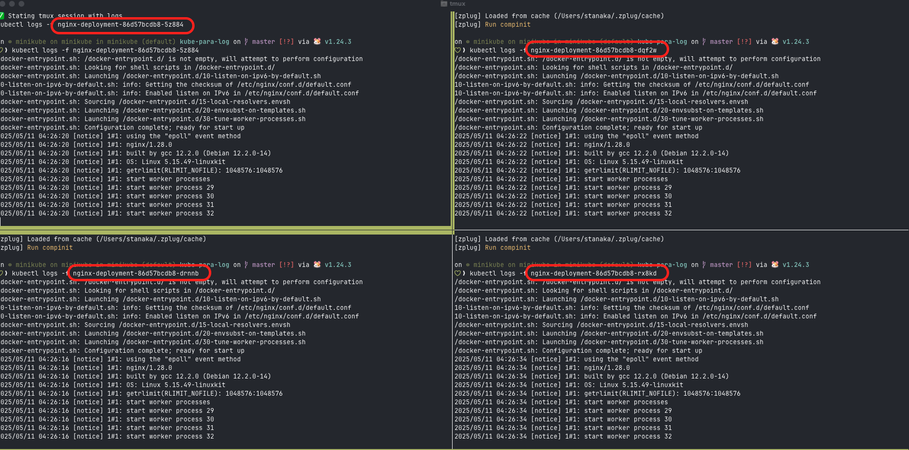
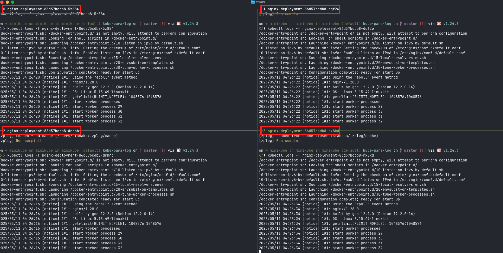
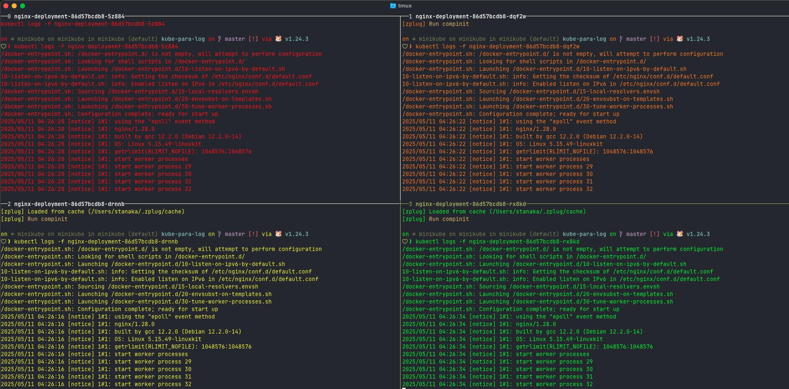
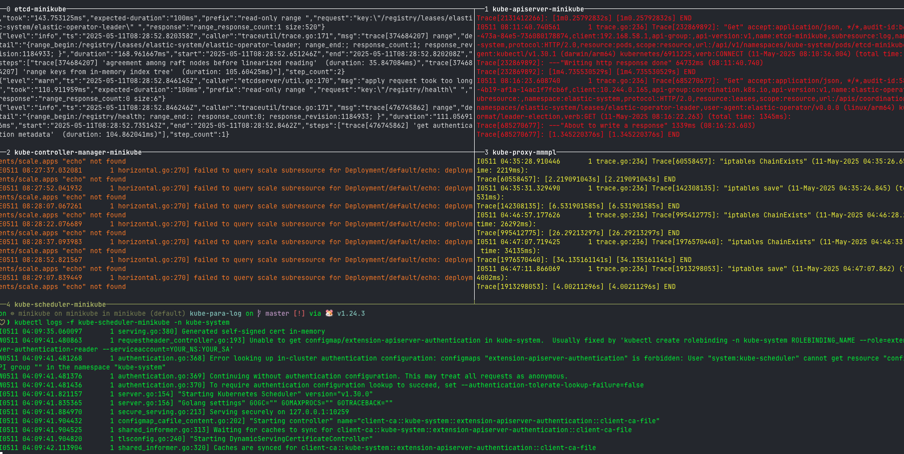
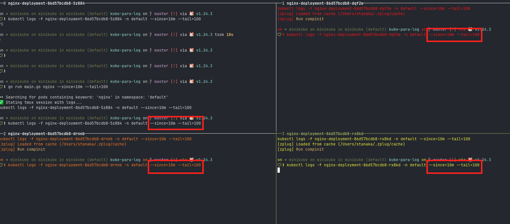
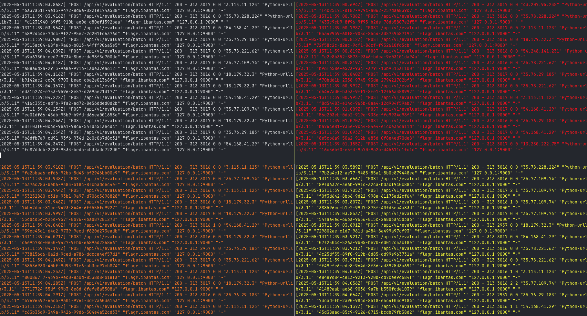

# kubernetes logs para

**Date:** 2025-05-11 11:43:51

## はじめに

初めまして。
スタンバイではInfra&DataグループでInfraのチームに所属しているshooonngです。
日頃Infraチームの業務でKubernetesのpodのログを見ながらアプリケーションの監視をする機会が多いです。
普段は[stern](https://github.com/stern/stern)を使ってアプリケーションのログを見ているのですが、
複数のpodのアプリケーションログを同時には見れないので少し煩わしさを感じていました。

技術書典に参加してみないかという話をいただ際に、記事を書くというモチベーションのもと重い腰を上げてツールを作成することに決めました。
本記事はその際に開発したツールの紹介を主にしていきます。

## 技術概要

CLIツールとして作成したかったので今回はGolangを採用することにしました。
その際、CLIパーサーは人気のある[cobra](https://github.com/spf13/cobra-cli)を採用しました。
ペインの分割には[tmux](https://github.com/tmux/tmux/wiki)を採用しました。

## Go CLIパーサー（cobra）を導入

cobra インストール
```
go install github.com/spf13/cobra-cli@latest
```

作成したディレクトリ内でcobraを初期化する
```
 cobra-cli init
```

## CLI引数で対象のキーワード（例：nginx）を受け取れるようにする

`cobra.ExactArgs(1)`で引数を1つのみ取得するようにした。

## kubectl get pods を使って、該当するpod名の一覧を取得する

`kubectl get pods -o json`を実行してpodsをjson形式で表示して、その後pods名を取得するようにする。

```go
func FindMatchingPods(keyword string) ([]string, error) {
	cmd := exec.Command("kubectl", "get", "pods", "-o", "json")
	output, err := cmd.Output()
	if err != nil {
		return nil, fmt.Errorf("failed to run kubectl: %w", err)
	}

	var podList PodList
	if err := json.Unmarshal(output, &podList); err != nil {
		return nil, fmt.Errorf("failed to parse kubectl output: %w", err)
	}

	var matched []string
	for _, item := range podList.Items {
		name := item.Metadata.Name
		if strings.Contains(name, keyword) {
			matched = append(matched, name)
		}
	}

	return matched, nil
}
```

以下のようにpodsがあれば
```sh
❯ kubectl get pods
NAME                                READY   STATUS    RESTARTS   AGE
nginx-deployment-86d57bcdb8-5z884   1/1     Running   0          12m
nginx-deployment-86d57bcdb8-dqf2w   1/1     Running   0          12m
nginx-deployment-86d57bcdb8-drnnb   1/1     Running   0          12m
nginx-deployment-86d57bcdb8-rx8kd   1/1     Running   0          12m
```

ツールを実行するとpodsのnameを取得する
```sh
❯ go run main.go nginx
👓 Searching for pods containing keyword: 'nginx'
✅ Mathed pods:
 - nginx-deployment-86d57bcdb8-5z884
 - nginx-deployment-86d57bcdb8-dqf2w
 - nginx-deployment-86d57bcdb8-drnnb
 - nginx-deployment-86d57bcdb8-rx8kd
```

## tmux を使って、pod数に応じたスプリット画面を自動生成する
エラーが出て苦労した。理由はtmux実行中にtmuxコマンドを使用できないことに気づいていなかったからだ。
tmux実行中かを判断する処理を追加した。
```Go
func isInsideTmux() bool {
	return len(os.Getenv("TMUX")) > 0
}
```

tmuxの外部から実行したときはtmuxの新しいセッション立ち上げる
```Go
insideTmux := isInsideTmux()

	if !insideTmux {
		// kill session if it exists
		_ = exec.Command("tmux", "kill-session", "-t", sessionName).Run()

		// 1. create new tmux session (detached)
		if err := exec.Command("tmux", "new-session", "-d", "-s", sessionName).Run(); err != nil {
			return fmt.Errorf("failed to create tmux session: %w", err)
		}
	}
```

pod数を順番に数えて奇数か偶数を判定して画面の分割方法を変更する
```Go
for i, pod := range podNames {
		if i > 0 {
			// split pane, select new one, run command
			splitDirection := "-h"
			if i%2 == 0 {
				splitDirection = "-v"
			}
			exec.Command("tmux", "split-window", splitDirection, "-t", target).Run()
			exec.Command("tmux", "select-layout", "-t", target, "tiled").Run()
		}

		cmd := fmt.Sprintf("kubectl logs -f %s", pod)
		if err := exec.Command("tmux", "send-keys", "-t", target, cmd, "C-m").Run(); err != nil {
			return fmt.Errorf("failed to send command to tmux: %w", err)
		}
	}
```

結果以下のように分割される


## 各paneのタイトルにpod名

以下を追加することでpaneにpod名をつけられる
```go
exec.Command("tmux", "select-pane", "-t", target, "-T", pod).Run()
```

paneにタイトル名が表示されない場合は以下のの設定を`~/.tmux.conf`に追加する
```conf
set-option -g pane-border-format "#{pane_index} #[bold]#{pane_title}"
set-option -g pane-border-status top
```

再度読み込む
```
tmux source-file ~/.tmux.conf
```



## スプリットされた各画面のログに色をつける

色を宣言して、tmuxに設定した。
```go
var PaneColors = []string{
	"fg=colour196",
	"fg=colour208",
	"fg=colour226",
	"fg=colour46",
	"fg=colour51",
	"fg=colour27",
	"fg=colour129",
	"fg=colour15",
}

...

color := PaneColors[i%len(PaneColors)]
exec.Command("tmux", "select-pane", "-t", target, "-P", color).Run()
```



## namespaceの指定に対応（例：--namespace=kube-system）

namespaceを指定できるように修正した。
cmd/root.goは以下のようにnamespaceを定数にし、`func init()`内に入れることで引数に指定できる。

```go
var namespace string

...

func init() {
	rootCmd.Flags().StringVarP(&namespace, "namespace", "n", "default", "Kubernetes maespace to search pods in")
}
```

関数の引数に追加
```go
...
pods, err := kubectl.FindMatchingPods(keyword, namespace)
...
err = tmux.StartTmuxWithLogs("kube-para-log", pods, namespace)
...
```

`internal/kubectl/pods.go`の`kubectl`使用部分を修正
```go
func FindMatchingPods(keyword string, namespace string) ([]string, error) {
	cmd := exec.Command("kubectl", "get", "pods", "-n", namespace, "-o", "json")
	...
}
```

`internal/tmux/layout.go`の`kubectl`使用部分を修正
```go
func StartTmuxWithLogs(sessionName string, podNames []string, namespace string) error {
	...

	// 2. create panes and run logs
	for i, pod := range podNames {
		...

		cmd := fmt.Sprintf("kubectl logs -f %s -n %s", pod, namespace)
		...
	}

	...

}
```

以下のpodのログを検索する
```sh
❯ k get pods -n kube-system | grep kube
etcd-minikube                      1/1     Running   6 (4h2m ago)      274d
kube-apiserver-minikube            1/1     Running   87 (4h2m ago)     274d
kube-controller-manager-minikube   1/1     Running   52 (4h2m ago)     327d
kube-proxy-mmmpl                   1/1     Running   7 (4h2m ago)      327d
kube-scheduler-minikube            1/1     Running   26 (4h2m ago)     327d
```

```sh
❯ go run main.go kube --namespace kube-system
```



## --since や --tail など kubectl logs の追加オプションに対応
`since`と`tail`コマンドに対応するようにした。

`cmd/root.go`のinit関数に定数を追加

```go
var (
	namespace string
	since     string
	tail      int
)

...

func init() {
	rootCmd.Flags().BoolP("toggle", "t", false, "Help message for toggle")
	rootCmd.Flags().StringVarP(&namespace, "namespace", "n", "default", "Kubernetes maespace to search pods in")
	rootCmd.Flags().StringVar(&since, "since", "", "Only return logs newer than a relatice duration like 5s, 2m, or 3h")
	rootCmd.Flags().IntVar(&tail, "tail", 10, "Lines of recent log file to display (0 = all)")
}
```

`internal/tmux/layout.go`に以下を追加した
```go
func StartTmuxWithLogs(sessionName string, podNames []string, namespace string, since string, tail int) error {
	...
	for i, pod := range podNames {

			cmd := fmt.Sprintf("kubectl logs -f %s -n %s", pod, namespace)
			if since != "" {
				cmd += fmt.Sprintf(" --since=%s", since)
			}
			if tail > 0 {
				cmd += fmt.Sprintf(" --tail=%d", tail)
			}

			if err := exec.Command("tmux", "send-keys", "-t", target, cmd, "C-m").Run(); err != nil {
				return fmt.Errorf("failed to send command to tmux: %w", err)
			}
		}
	...
}
```

以下を実行する
```sh
❯ go run main.go nginx --since=10m --tail=100
```



## 特定のcontainer名指定に対応（例：--container=envoy）
container名を選択することで柔軟に色々なcontainerのログを見ることができるようになった。

`cmd/root.go`のinit関数に定数を追加
```go
var (
+	container strint
	namespace string
	since     string
	tail      int
)

...

func init() {
	rootCmd.Flags().BoolP("toggle", "t", false, "Help message for toggle")
	rootCmd.Flags().StringVarP(&namespace, "namespace", "n", "default", "Kubernetes maespace to search pods in")
	rootCmd.Flags().StringVar(&since, "since", "", "Only return logs newer than a relatice duration like 5s, 2m, or 3h")
	rootCmd.Flags().IntVar(&tail, "tail", 10, "Lines of recent log file to display (0 = all)")
+ rootCmd.Flags().StringVarP(&container, "container", "c", "", "Target container name (for multi-container pods)")
}
```

`internal/tmux/layout.go`に以下を追加した
```go
+ func StartTmuxWithLogs(sessionName string, podNames []string, namespace string, since string, tail int, container string) error {
	...
	for i, pod := range podNames {

			cmd := fmt.Sprintf("kubectl logs -f %s -n %s", pod, namespace)
		+	if container != "" {
		+		cmd += fmt.Sprintf(" --container=%s", container)
		+	}

			...

			if err := exec.Command("tmux", "send-keys", "-t", target, cmd, "C-m").Run(); err != nil {
				return fmt.Errorf("failed to send command to tmux: %w", err)
			}
		}
	...
}
```

以下を実行する
```sh
❯ ./kube-para-log flagr -n jse-a -c envoy
```



## 終わりに
普段EKSでログを見る際にsternを使用していて、複数のペインでログを見れたら良いなという願望を叶えることができた。
実際のインフラ作業の見守りでもこのツールが大いに役に立った。
まだ課題として--selector 対応で Pod 絞り込みを強化したり、どのコンテナのログを見てるのかわかるようなUIの工夫ができると思うので引き続き頑張る。
