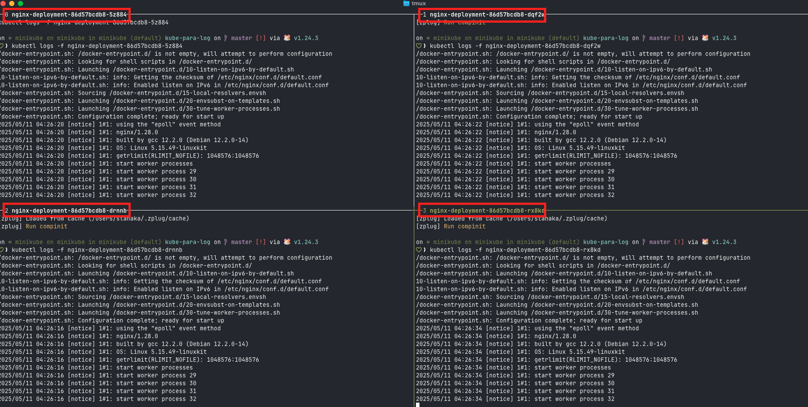

# tmux + kubectl logs -fで複数ペインでログを見るツールを作成した話

## はじめに

初めまして。
スタンバイではInfra\&DataグループのInfraチームに所属しているshooonngです。
日頃はInfraチームの業務として、KubernetesのPodログを確認しながらアプリケーションの監視を行う機会が多くあります。
普段は[stern](https://github.com/stern/stern)を使ってアプリケーションのログを見ているのですが、
複数のPodのログを1画面で同時に見られないことに、少し煩わしさを感じていました。

技術書典に参加しないかというお話をいただいたのをきっかけに、「記事を書く」というモチベーションを糧に、重い腰を上げてツールを作成することにしました。
本記事では、その際に開発したツールの紹介を中心にお届けします。

## ツールの構想と技術選定

以下のような構想と技術選定をざっくりと決めました。

* 任意のキーワードでPodを絞り込める
* キーワードに合致したPodごとに `kubectl logs -f` を実行し、tmuxでペインを分割して表示する
* namespaceやcontainerを指定できる
* CLIツールとしてサクッと作成でき、ライブラリが充実しているGoで実装する

## 苦労した点
### tmux内でtmuxを実行していた問題

Podのリストを取得し、いよいよ `kubectl logs -f` を実行しつつ、tmuxでペインを分割しようとしたところでエラーが発生しました。
tmuxのコマンド自体には問題がないように見えた（主に `split-window`、`select-layout`、`send-keys` を使用）のですが、
原因はtmuxセッション内でさらにtmuxコマンドを呼び出していたことでした。

解決策として、環境変数 `TMUX` を確認することで、tmuxの外部から実行されているかを判定しました。

```go
func isInsideTmux() bool {
	return len(os.Getenv("TMUX")) > 0
}
```

結果、以下のように正常にペインが分割されるようになりました！


### サイドカーコンテナのログを優先的に出力する

`stern`では`envoy`などのログを優先的に確認していたため、今回のツールでも同様の挙動を再現したいと考えました。

PodのJSONデータの中から `containerStatuses` に `envoy`、`fluentd`、`datadog` が含まれている場合、それらのログを優先的に表示するように実装しました。

```go
func GuessBestContainerName(pod string, namespace string) (string, error) {
	cmd := exec.Command("kubectl", "get", "pod", pod, "-n", namespace, "-o", "json")
	out, err := cmd.Output()
	if err != nil {
		return "", fmt.Errorf("failed to get pod json: %w", err)
	}

	var result struct {
		Status struct {
			ContainerStatuses []struct {
				Name string `json:"name"`
			} `json:"containerStatuses"`
		} `json:"status"`
	}

	if err := json.Unmarshal(out, &result); err != nil {
		return "", fmt.Errorf("failed to parse pod json: %w", err)
	}

	for _, cs := range result.Status.ContainerStatuses {
		if isSidecarContainer(cs.Name) {
			return cs.Name, nil
		}
	}

	return "", fmt.Errorf("no non-sidecar container found")
}

func isSidecarContainer(name string) bool {
	sidecars := []string{"envoy", "fluentd", "datadog"}
	for _, sc := range sidecars {
		if strings.Contains(name, sc) {
			return true
		}
	}
	return false
}
```

## 工夫してよかった点

### 各ペインにPod名をタイトル表示

ペインのタイトルにログを出力しているPod名を設定することで、視認性が格段に向上しました。

```go
exec.Command("tmux", "select-pane", "-t", target, "-T", pod).Run()
```

もしタイトルが表示されない場合は、以下の設定を `~/.tmux.conf` に追記してください。

```conf
set-option -g pane-border-format "#{pane_index} #[bold]#{pane_title}"
set-option -g pane-border-status top
```

設定を再読み込みします：

```
tmux source-file ~/.tmux.conf
```



## 使用例

使い方は以下の通りです。

```
Usage:
  kube-para-log [keyword] [flags]

Flags:
  -c, --container string   Target container name (for multi-container pods)
  -h, --help               help for kube-para-log
  -n, --namespace string   Kubernetes namespace to search pods in (default "default")
      --since string       Only return logs newer than a relative duration like 5s, 2m, or 3h
      --tail int           Lines of recent log file to display (0 = all) (default 10)
```

* `-c, --container`：コンテナ名の指定
* `-n, --namespace`：Namespaceの指定
* `--since`：過去のログをどこから表示するかの時間指定
* `--tail`：ログの出力行数の指定

```sh
./kube-para-log flagr -n jse-a -c envoy
```


## 今後の展望・やってみての感想

今後は `--selector` に対応して、より柔軟にPodを絞り込めるようにしたいと考えています。
また、どのログが何に対応しているかを瞬時に見分けられるようなUIの工夫も続けていきたいです。

「これ、自分の環境でも使いたいな」と思った方がいれば、ぜひ試してみてください！

自作したツールが実務で使えるようになり、改めて作ってよかったと実感しています。

ここまで読んでいただきありがとうございました！
