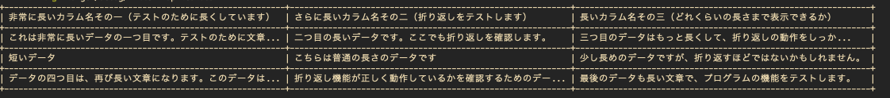
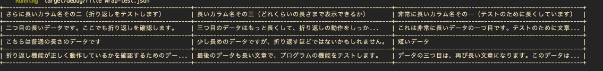

## はじめに

アドベントカレンダー9日目を担当するInfra&Data グループのたなしょです。

普段の業務では、AWSのコスト削減を目的に各リソースの構成を考えたり、EKS周りのモニタリングやAWSリソースの検証を行っています。

最近は趣味でRustやHaskell、Terraformをよく触っています。

## なぜ作るのか

AWS関連の調査をする際には、AWS CLIから特定のコマンドを実行してリソースの情報を取得しています。その際、標準出力をパイプラインでつなぎ、jqを使ってJSONの特定箇所を抜き出したり、データをCSV形式で出力する機会が増えてきました。

JSONファイルやCSVファイルを確認するとき、画面を切り替えるのが少し面倒だなと感じることがありました。また、大好きなCUI環境から出たくないという我儘もあり、アドベントカレンダーの記事ネタとしてツールを自作することにしました。

言語は、最近趣味で触っていて楽しいRustを使用することにしました。

## 作って良かったこと

- 日頃から使用できるツールができた

- Rustで今まで知らなかったライブラリや仕様を理解することができた

### 日頃から使用できるツールができた

調査を日々実施する中で、素早く使えるツールとして役立っています

CUI環境を離れることなくファイルを確認できるので、ストレスが軽減されました

## Rustで今まで知らなかったライブラリや仕様を理解することができた

テーブルを形成するためのprettytableライブラリの存在と仕様について学びました

機能ごとにファイルを分割する方法を学びました

## 完成したツール

### **CSVファイル**
以下のような長めなCSVファイルを読み込み、テーブル形式で表示します。   
長い文字列は折り返され、最大幅を超える場合は末尾に「...」が付けられます。   

```csv
"非常に長いカラム名その一（テストのために長くしています）","さらに長いカラム名その二（折り返しをテストします）","長いカラム名その三（どれくらいの長さまで表示できるか）"
"これは非常に長いデータの一つ目です。テストのために文章を長くしています。","二つ目の長いデータです。ここでも折り返しを確認します。","三つ目のデータはもっと長くして、折り返しの動作をしっかりとテストします。"
"短いデータ","こちらは普通の長さのデータです","少し長めのデータですが、折り返すほどではないかもしれません。"
"データの四つ目は、再び長い文章になります。このデータは折り返されるべきです。","折り返し機能が正しく動作しているかを確認するためのデータです。","最後のデータも長い文章で、プログラムの機能をテストします。"
```



### **JSONファイル**
以下のような長めなCSVファイルを読み込み、テーブル形式で表示します。   
長い文字列は折り返され、最大幅を超える場合は末尾に「...」が付けられます。   

```json
[
    {
        "非常に長いカラム名その一（テストのために長くしています）": "これは非常に長いデータの一つ目です。テストのために文章を長くしています。",
        "さらに長いカラム名その二（折り返しをテストします）": "二つ目の長いデータです。ここでも折り返しを確認します。",
        "長いカラム名その三（どれくらいの長さまで表示できるか）": "三つ目のデータはもっと長くして、折り返しの動作をしっかりとテストします。"
    },
    {
        "非常に長いカラム名その一（テストのために長くしています）": "短いデータ",
        "さらに長いカラム名その二（折り返しをテストします）": "こちらは普通の長さのデータです",
        "長いカラム名その三（どれくらいの長さまで表示できるか）": "少し長めのデータですが、折り返すほどではないかもしれません。"
    },
    {
        "非常に長いカラム名その一（テストのために長くしています）": "データの三つ目は、再び長い文章になります。このデータは折り返されるべきです。",
        "さらに長いカラム名その二（折り返しをテストします）": "折り返し機能が正しく動作しているかを確認するためのデータです。",
        "長いカラム名その三（どれくらいの長さまで表示できるか）": "最後のデータも長い文章で、プログラムの機能をテストします。"
    }
]
```



## 技術仕様
### ファイル構成
プロジェクトは以下のファイルで構成されています。

- Cargo.toml：依存クレートの定義
- src/
  - main.rs：エントリーポイント。ファイルの種類に応じて適切な処理を呼び出します。
  - csv_reader.rs：CSVファイルを読み込み、テーブルデータに変換します。
  - json_reader.rs：JSONファイルを読み込み、テーブルデータに変換します。
  - utils.rs：汎用的なユーティリティ関数（コマンドライン引数の取得や折り返しなど）を含みます。

---

### 機能の概要と実装

### **csv_reader.rs**
1. **CSVファイルのオープンとリーダーの作成**

   ```rust
   let file = File::open(file_path)?;
   let mut rdr = ReaderBuilder::new().from_reader(file);
   ```

   - `File::open`でファイルを開き、`csv::ReaderBuilder`でCSVリーダーを作成します。

2. **セル内テキストの最大幅の設定と切り取り関数の適用**

   ```rust
   fn truncate_text(text: &str, max_width: usize) -> String {
       if text.chars().count() > max_width {
           let truncated: String = text.chars().take(max_width - 3).collect();
           format!("{}...", truncated)
       } else {
           text.to_string()
       }
   }

   // セルの最大幅を設定
   let max_cell_width = 30; // 必要に応じて調整可能
   ```

   - `truncate_text`関数で、テキストが`max_cell_width`を超える場合に末尾に「...」を付けて切り取ります。

3. **ヘッダー行の作成**

   ```rust
   let headers = rdr.headers()?;
   let header_cells = headers.iter().map(|h| {
       let truncated_text = truncate_text(h, max_cell_width);
       Cell::new(&truncated_text)
   }).collect();
   let header_row = Row::new(header_cells);
   table.add_row(header_row);
   ```

   - CSVのヘッダーを取得し、各ヘッダー名を`truncate_text`関数で処理してセルを作成します。

4. **データ行の作成**

   ```rust
   for result in rdr.records() {
       let record = result?;
       let cells = record.iter().map(|r| {
           let truncated_text = truncate_text(r, max_cell_width);
           Cell::new(&truncated_text)
       }).collect();
       let row = Row::new(cells);
       table.add_row(row);
   }
   ```

   - 各レコードを読み込み、セル内のテキストを`truncate_text`で処理してテーブルに追加します。

#### **エラーハンドリング**

- ファイルのオープンや読み込み時にエラーが発生した場合、`Result`型でエラーを返します。
- CSVのパースエラーも適切に処理します。

#### **依存クレート**

- `csv`：CSVファイルの読み込みとパース。
- `prettytable`：テーブルの作成と表示。

---

### **json_reader.rs**

#### **目的**

- **JSONファイルの読み込み**：指定されたJSONファイルを読み込み、データをパースします。
- **テーブルの生成**：パースしたデータを`prettytable`クレートを使用してテーブル形式に整形します。
- **長い文字列の処理**：セル内のテキストが長い場合、指定した最大幅で切り取り、テーブルのレイアウトを維持します。

#### **主な機能と実装**

1. **JSONファイルのオープンとパース**

   ```rust
   let file = File::open(file_path)?;
   let json_data: Value = serde_json::from_reader(file)?;
   ```

   - `File::open`でファイルを開き、`serde_json::from_reader`でJSONデータを`serde_json::Value`型としてパースします。

2. **セル内テキストの最大幅の設定と切り取り関数の適用**

   - `truncate_text`関数と`max_cell_width`の設定は`csv_reader.rs`と同様です。

3. **ヘッダー行の作成**

   ```rust
   if let Some(array) = json_data.as_array() {
       let headers = if let Some(first_item) = array.first() {
           if let Some(obj) = first_item.as_object() {
               obj.keys().cloned().collect::<Vec<_>>()
           } else {
               return Err("JSON array does not contain objects".into());
           }
       } else {
           return Err("JSON array is empty".into());
       };

       let header_cells = headers.iter().map(|h| {
           let truncated_text = truncate_text(h, max_cell_width);
           Cell::new(&truncated_text)
       }).collect();
       let header_row = Row::new(header_cells);
       table.add_row(header_row);
   } else {
       return Err("JSON file does not contain an array at the root".into());
   }
   ```

   - JSONデータが配列であり、各要素がオブジェクトであることを確認します。
   - 最初のオブジェクトのキーを取得し、ヘッダーとして使用します。

4. **データ行の作成**

   ```rust
   for item in array {
       if let Some(obj) = item.as_object() {
           let cells = headers.iter().map(|key| {
               let value = obj.get(key).unwrap_or(&Value::Null);
               let cell_text = match value {
                   Value::Null => "".to_string(),
                   Value::String(s) => s.clone(),
                   Value::Number(n) => n.to_string(),
                   Value::Bool(b) => b.to_string(),
                   _ => "".to_string(),
               };
               let truncated_text = truncate_text(&cell_text, max_cell_width);
               Cell::new(&truncated_text)
           }).collect();
           let row = Row::new(cells);
           table.add_row(row);
       }
   }
   ```

   - 各オブジェクトの値を取得し、`truncate_text`関数で処理してセルを作成します。
   - データ型に応じて値を文字列に変換します。

#### **エラーハンドリング**

- ファイルのオープンやJSONのパースエラーを適切に処理します。
- JSONデータが期待する形式でない場合（配列でない、オブジェクトでないなど）、エラーメッセージを返します。

#### **依存クレート**

- `serde` および `serde_json`：JSONファイルのパースとデータの扱い。
- `prettytable`：テーブルの作成と表示。

---
### **共通の技術的ポイント**

- **テキストの切り取り**：`truncate_text`関数を使用して、セル内のテキストが指定した最大幅を超える場合に切り取ります。末尾に「...」を付けて、テキストが切り取られていることを示します。

    ```rust
    pub fn truncate_text(text: &str, max_width: usize) -> String {
        if text.chars().count() > max_width {
            let truncated: String = text.chars().take(max_width - 3).collect();
            format!("{}...", truncated)
        } else {
            text.to_string()
        }
    }
    ```

- **テーブルのフォーマット**：`FormatBuilder`を使用して、テーブルの境界線、パディング、区切り線をカスタマイズしています。これにより、見やすいテーブル表示を実現しています。

- **エラーハンドリング**：ファイルの読み込みエラー、データのパースエラー、データ形式の不一致など、想定されるエラーに対して適切に対処しています。

- **依存クレートの活用**：`csv`、`serde_json`、`prettytable`などのクレートを効果的に活用し、コードの簡潔化と機能の充実を図っています。

## おわりに

日頃行っている行動をCUIツール化できて良かったです。  
Rustを書くことでさまざまなライブラリを理解することができ、非常に勉強になりました。  
今後も業務で使えそうなツールをいろいろと作っていきたいです。  
最後まで読んでいただき、ありがとうございました。

## 参考

https://docs.rs/prettytable/latest/prettytable/ 

https://docs.rs/csv/latest/csv/ 

https://docs.rs/serde/latest/serde/ 

https://docs.rs/serde_json/latest/serde_json/ 

